# Lab 1: Operating MongoDB with Ansible

Course: Non-relational databases, Autumn 2026
Run date: 7 October 2026 (all times in the screenshots are VM time, EDT)
Host: Ubuntu 22.04 VM in VMware Workstation, hostname `ubuntu-lab8`, no Docker

## Summary

The whole lab is one playbook, `ansible/lab1.yml`, with four roles: `mongodb`, `rbac`, `backup` and `monitoring`. Each item of the assignment has its own tag, so every operation can be run separately and repeated later. I did not use `mongosh` by hand to administer anything. The only manual commands in this report are verification-only checks (`cat`, `systemctl status`, `journalctl`, `curl`, and one `mongosh` call without credentials) that I used to look at the result from a second angle.

I ran everything from a VM snapshot that had neither MongoDB nor Ansible installed, in the order of the assignment. The only things I installed by hand were the tools needed to *run* Ansible on this machine: Python 3.12 from the deadsnakes PPA (Ubuntu 22.04 ships 3.10) and Ansible itself in a virtualenv (screenshots 02–05). Everything about MongoDB and its monitoring was installed by the playbook. Main results:

| Area | Result | What it shows |
|---|---|---|
| Deployment | MongoDB 9.0.2 from the official repository; `ping` returns `1` | The server answers real commands, not just a TCP port |
| Autostart | After a real `reboot`: system up at 18:22:27, `mongod` active at 18:22:47 | systemd started MongoDB during boot without any manual command |
| Service control | `stop` / `start` / `restart` / `status` as separate runs; PID 3189 → 4222 after restart, unchanged by `status` | Each operation does exactly what it says and nothing else |
| Access control | 6 of 6 allowed/denied checks match the role design; unauthenticated `usersInfo` rejected | Roles really grant different operations, and the server enforces them |
| Backup | 5 archives kept side by side (420–612 bytes); the single-database, all-databases and recovery archives were validated with `mongorestore --dryRun` | Copies never overwrite each other, and the restore tool can read them |
| Recovery | `students` dropped and restored (1 → 0 → 1 document); a separate restore from a chosen archive | Recovery works from both a fresh backup and an older one |
| Monitoring | Load of 278.7 iterations/s: ~280 updates/s, ~280 queries/s, ~55 deletes/s, ~1.27 MB/s each way, connections 3 → 6 | The dashboard matches numbers I can calculate from the load script |

---

## 1. Approach

The teacher asked for automation rather than a list of `mongosh` commands, and I agree with the reasoning: a one-line command proves you know the syntax, while a playbook can bring a new machine to the same state again. So every administrative action is an Ansible task, and almost every important change is followed by a task that reads the state back from the server and asserts it. The pattern is always the same: **change → read back → assert**. A green "changed" only means a module sent a command; the read-back is what shows that the server actually ended up where I wanted.

```
lab1-ansible/
├── README.md                    # this report
├── screenshots/
└── ansible/
    ├── ansible.cfg
    ├── inventory.ini            # localhost, connection=local
    ├── requirements.yml         # community.mongodb 1.8.0
    ├── lab1.yml                 # the single entry point
    ├── group_vars/all/
    │   ├── main.yml             # names, ports, paths, versions
    │   ├── vault.yml            # passwords, encrypted with ansible-vault
    │   └── vault.yml.example    # which secrets vault.yml must define
    └── roles/
        ├── mongodb/             # part 1
        ├── rbac/                # part 2
        ├── backup/              # part 3
        └── monitoring/          # part 4
```

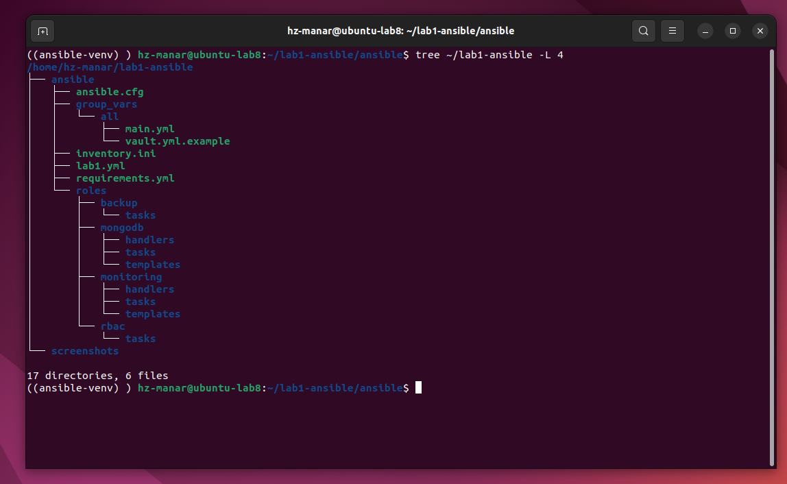

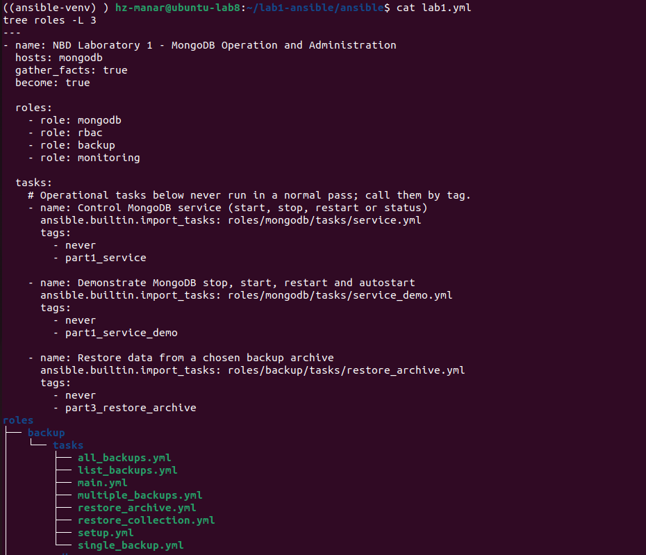

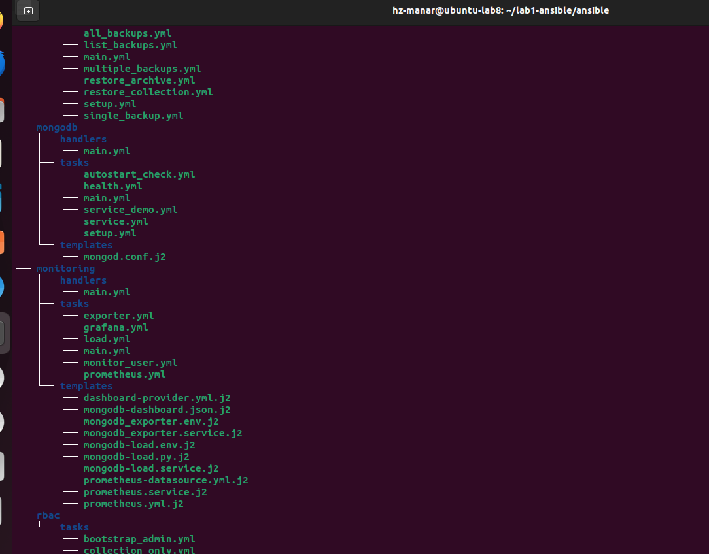


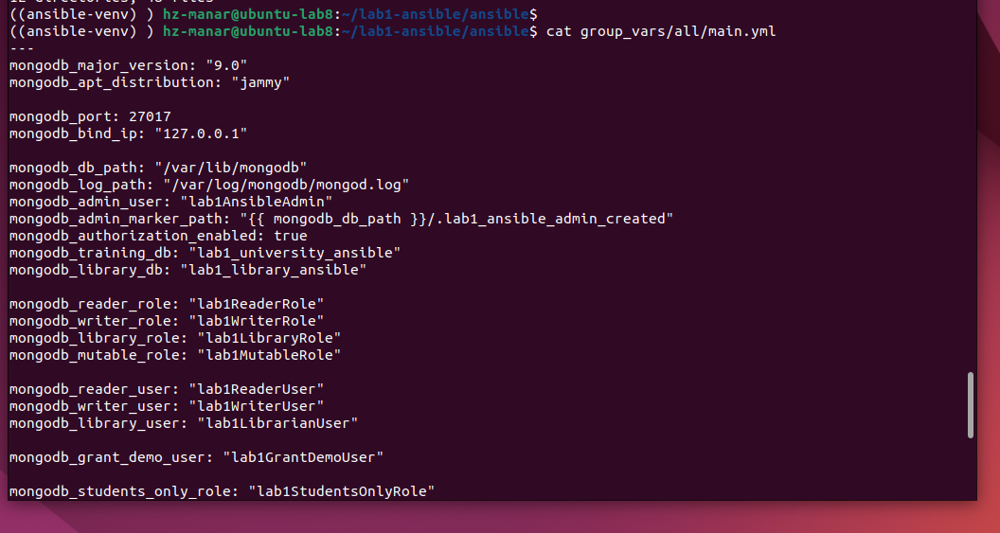

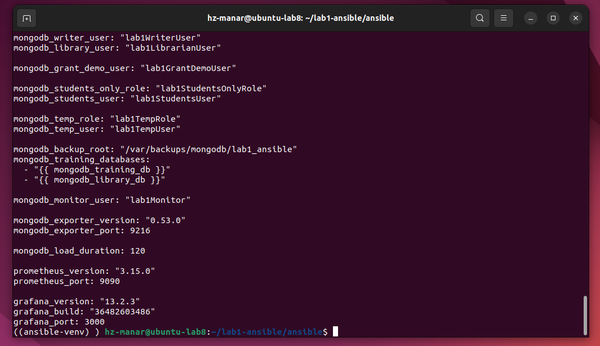

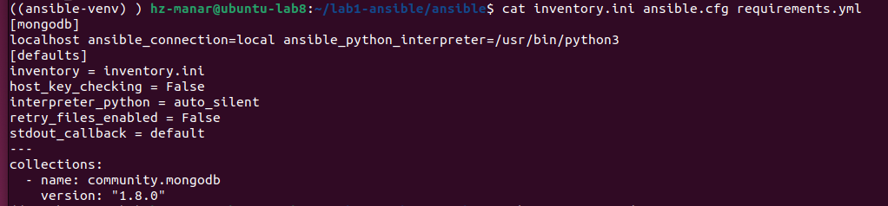

All names, ports, paths and versions live in `group_vars/all/main.yml`. Changing the port or the name of a training database is a one-line change, not a search through task files.

**A note on repeated runs.** Some steps were run more than once while I was taking the screenshots. On a repeated run Ansible reports `ok` instead of `changed` for anything that is already in the desired state, and does not do it again. That is why, for example, `part2_prerequisites` in screenshot 20 shows `changed=0` (PyMongo was already installed), and the exporter download and package in screenshot 51 show `ok`. This applies to the configuration tasks (packages, config files, services, users and roles), which are idempotent where practical. Demonstration and operational tasks (backup creation, restore tests, the role-transition demos and load generation) change state on purpose, so they report `changed` on every run.

## 2. Environment

| Component | Version |
|---|---|
| OS | Ubuntu 22.04 LTS, x86_64 |
| System Python (left untouched) | 3.10.12 |
| Python used by Ansible | 3.12.15, in `~/ansible-venv` |
| ansible-core | 2.21.5 |
| `community.mongodb` | 1.8.0 |
| PyMongo | 4.18.2, in `/opt/ansible-mongodb` |
| MongoDB Community Server | 9.0.2 |
| `mongosh` | 2.13.0 |
| Percona MongoDB Exporter | 0.53.0 |
| Prometheus | 3.15.0 |
| Grafana OSS | 13.2.3 |

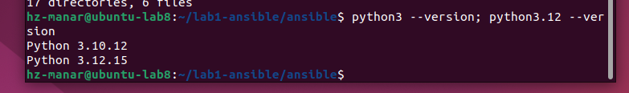

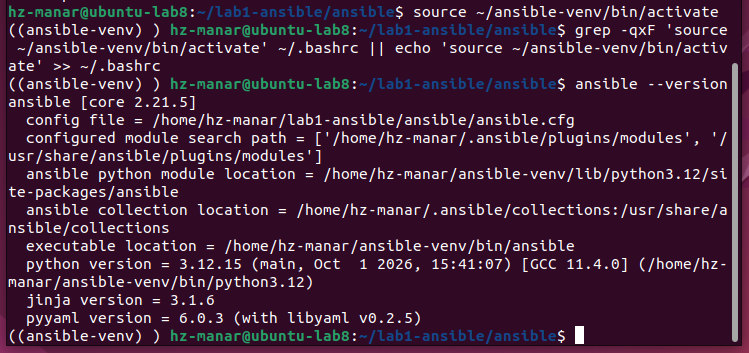

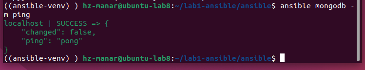

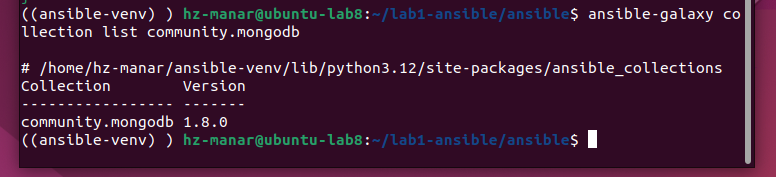

I did not replace the system Python 3.10, because apt and other system tools depend on it. Ansible runs from its own Python 3.12 virtualenv, and the MongoDB driver (PyMongo) has a separate virtualenv at `/opt/ansible-mongodb`. That gives three isolated layers: the OS, Ansible, and the MongoDB driver. When something fails, it is quick to see which layer is responsible.

Passwords are in `vault.yml`, encrypted with `ansible-vault`. Every task that touches a credential has `no_log: true`; without it, a failed task would print its arguments, including the password, to the terminal.

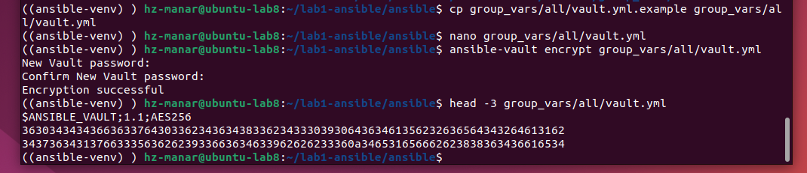

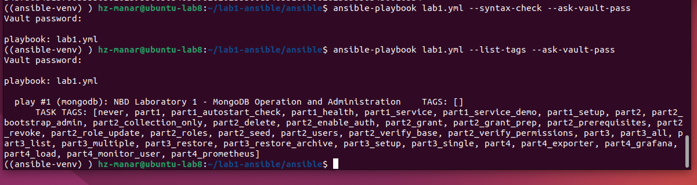

A note on the deprecation warnings that appear in several screenshots: `community.mongodb` 1.8.0 uses internal ansible-core helpers (`to_native`, `to_bytes`) that are deprecated in the current ansible-core release. They do not affect this run, but the collection should be retested or updated before moving to a future ansible-core release where those helpers are removed. I pinned the collection version so the lab environment stays reproducible.

---

## 3. Part 1: deployment and service control

### 3.1 Installing MongoDB (1.1)

The `mongodb` role adds the official MongoDB 9.0 APT repository, installs `mongodb-org`, renders `/etc/mongod.conf` from a template, then enables and starts the service. MongoDB listens only on `127.0.0.1`. Nothing in this lab needs remote access, and a database open on every interface is a bad default even on a lab VM.

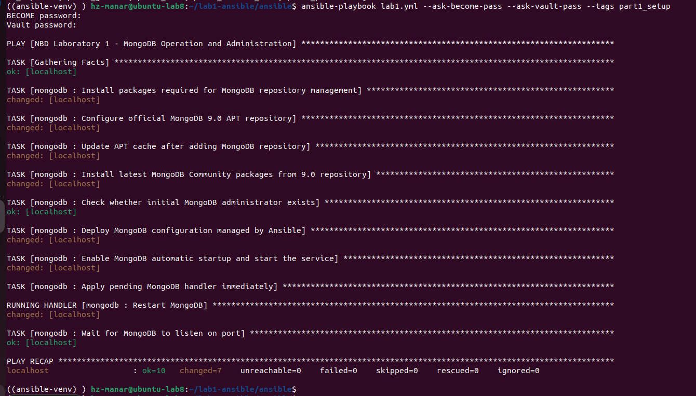

**Reading the result.** `ok=10 changed=7`. On a clean machine, seven changes are expected: base packages, repository, APT cache, MongoDB package, config file, service enable/start, and the handler restart that applies the new config. The three unchanged tasks are fact gathering, the administrator-marker check and the port wait, which only read state. The fact that even "Install packages required for repository management" reported `changed` confirms the VM really started without these packages.

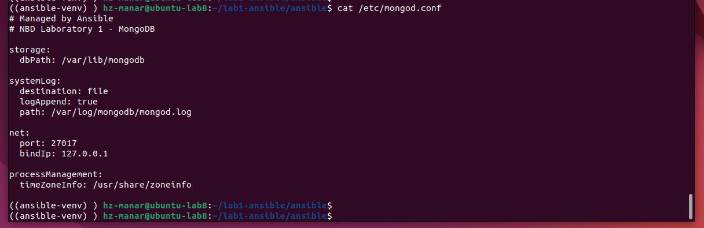

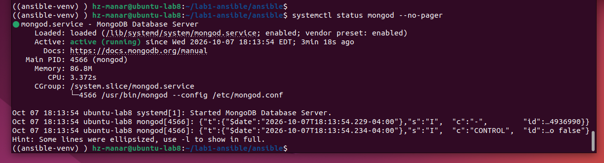

The config has no `security` section yet, on purpose. Authorization is switched on in part 2, only after an administrator exists (section 4.1).

### 3.2 Availability check (1.4)

The check has two layers: `wait_for` on the TCP port, then `mongosh` sends `db.adminCommand({ping: 1})` and the play asserts the answer is `1`.

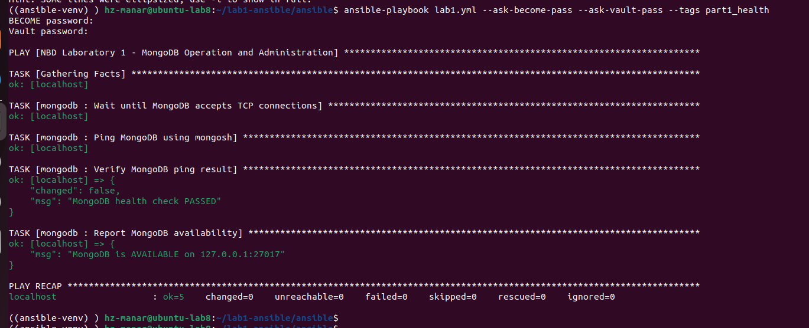

**Reading the result.** `MongoDB health check PASSED` and `MongoDB is AVAILABLE on 127.0.0.1:27017`, with `changed=0`. If the server is down, the check does not pass silently: when the port is closed, `wait_for` stops the play after 30 seconds with a timeout error, and when the port is open but `ping` fails, either the `mongosh` task itself fails or the assertion stops the play with `MongoDB health check FAILED`. Either way the run ends with `failed=1`, which is what a cron job or CI pipeline needs to raise an alert. The two layers catch different failures. An open port only means something is listening; `mongod` accepts TCP connections a moment before it is ready to run commands. `ping` goes through the full command path, so `1` means "ready". `ping` also works without authentication, so the same check keeps working after part 2 enables authorization. `changed=0` matters too: a health check must not change anything, so it is safe to run from cron or a monitoring job.

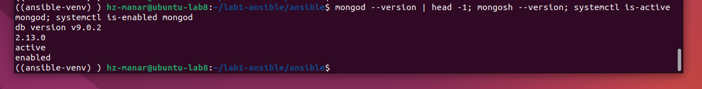

### 3.3 Automatic start after a reboot (1.2)

`enabled: true` in the role tells systemd to start `mongod` at boot. To prove it worked instead of assuming it, I rebooted the VM and, without starting anything by hand, ran the `part1_autostart_check` tag. It reports the system boot time and the time systemd marked `mongod` as active, then verifies that the service is active and enabled and that `ping` returns `1`. Comparing the two times is my own reading of the output, not an automated check.

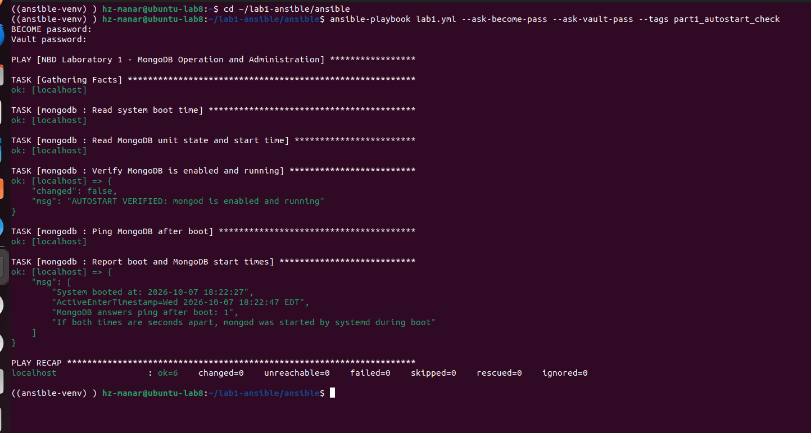

**Reading the result.** The system booted at **18:22:27** and `mongod` became active at **18:22:47**, 20 seconds later. I did not log in and start it in that window, so the only thing that could have started it was systemd during boot. Then `ping` returned `1`. The 20 seconds is the normal boot sequence: the network, then the services ordered before `mongod`, then MongoDB opening its data files.

### 3.4 Start, stop, restart (1.3)

`part1_service` takes the action as a variable, `-e mongodb_service_action=start|stop|restart|status`, so each operation is a separate, reusable command rather than a fixed demo. After the action, the task waits for the port to open or close, reads the unit state from systemd, and asserts that it matches the request.

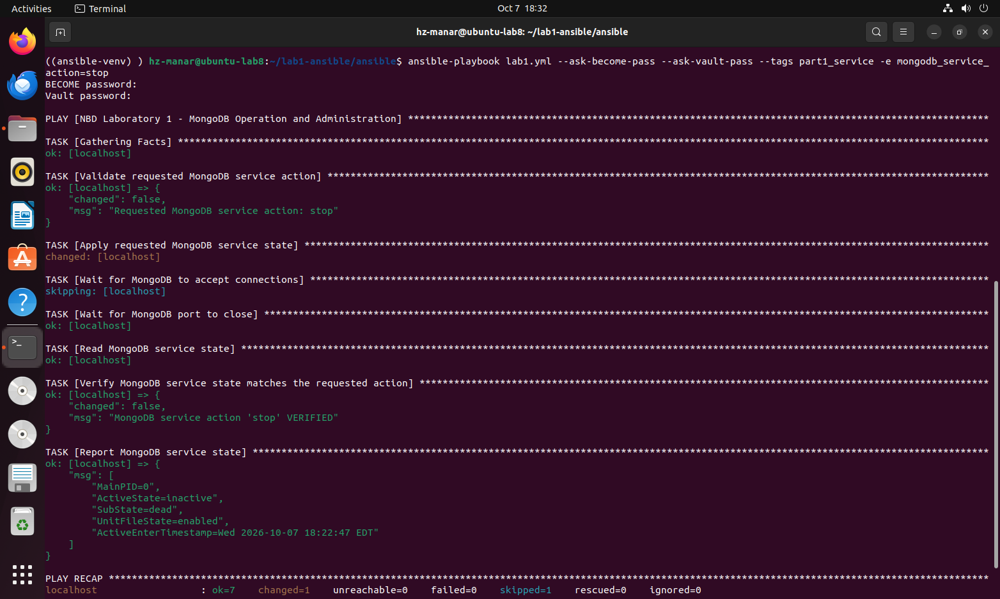

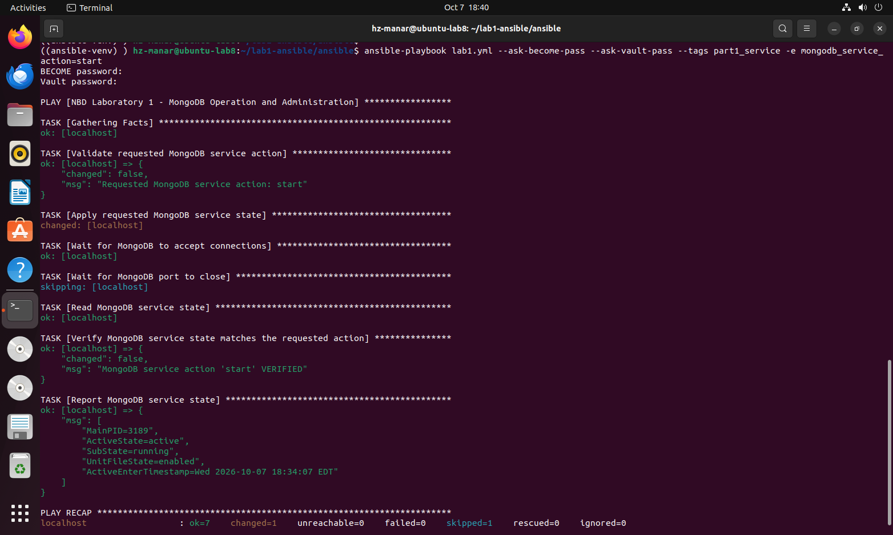

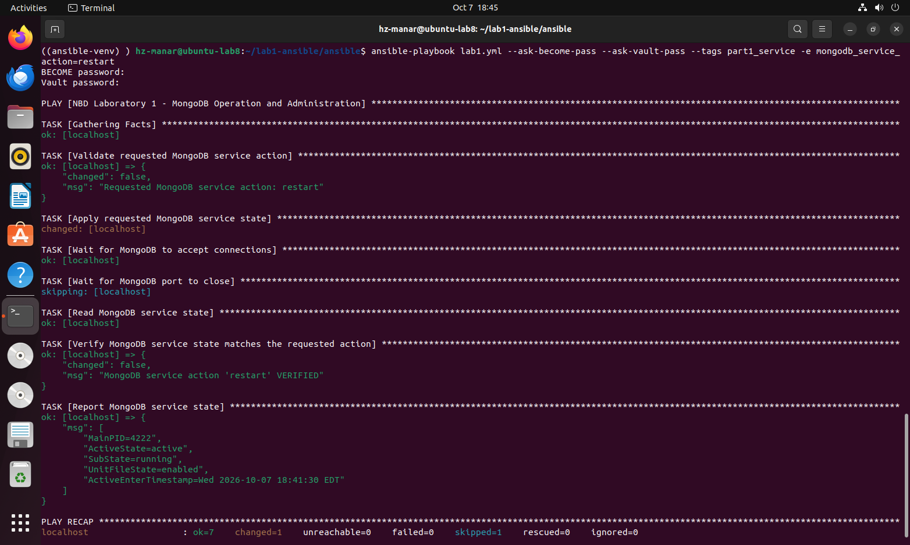

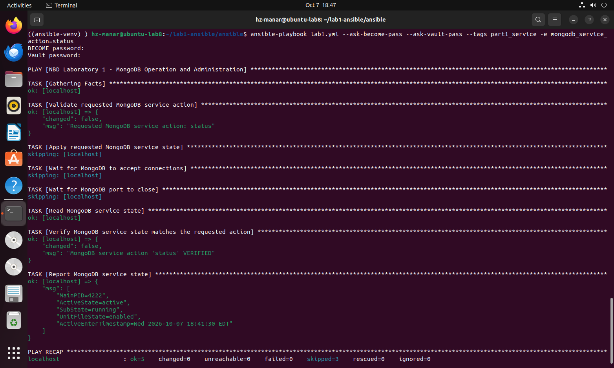

**Reading the result.** The PIDs and timestamps tell the story better than the green lines:

| Action | ActiveState | MainPID | Active since | changed |
|---|---|---|---|---|
| stop | inactive (dead) | 0 | (last start 18:22:47, at boot) | 1 |
| start | active (running) | 3189 | 18:34:07 | 1 |
| restart | active (running) | **4222** | **18:41:30** | 1 |
| status | active (running) | **4222** | **18:41:30** | 0 |

- `restart` produced a **new PID** and a new start time. That is the proof of a real restart: a process that only received a signal would keep its PID.
- `status` shows the **same PID and time** as the restart and `changed=0`, with the state-changing tasks skipped (`skipped=3`). It only reads.
- `UnitFileState=enabled` in every run. Stopping the service does not disable autostart; those are two independent settings in systemd.
- After systemd reports the service stopped, `wait_for` independently confirms that port 27017 is closed, so the check does not rely only on systemd's view of the unit.

---

## 4. Part 2: role-based access control

### 4.1 Order of operations

A new MongoDB has no users. If authorization is enabled first, the only way in is the localhost exception, which allows creating exactly **one** first user and then closes. Any mistake at that moment locks you out of the database. So the role works in this order:

1. Install PyMongo in its own virtualenv.
2. With authorization still off, create the administrator (`root` on `admin`). The module writes a marker file only when the user was really created.
3. A guard task refuses to continue if the marker is missing.
4. Render the config with `authorization: enabled` and restart `mongod`.
5. Verify: an unauthenticated privileged command must fail, and the administrator must be able to log in.

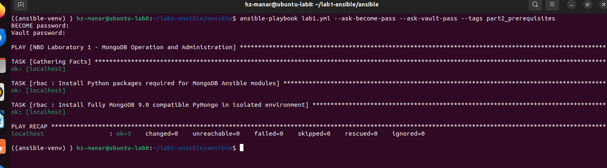

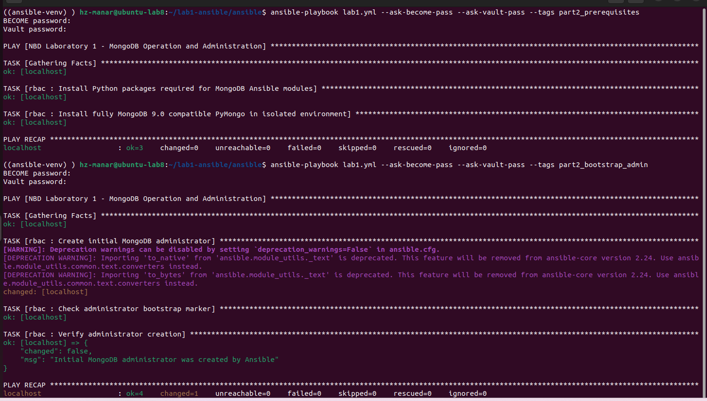

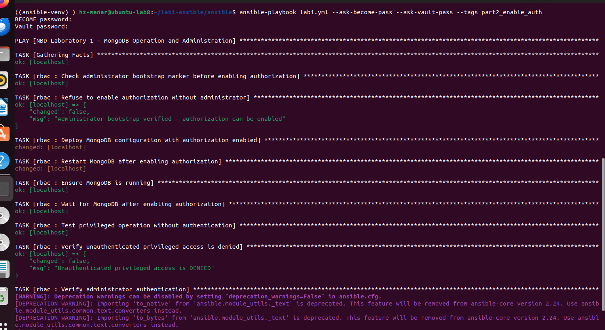

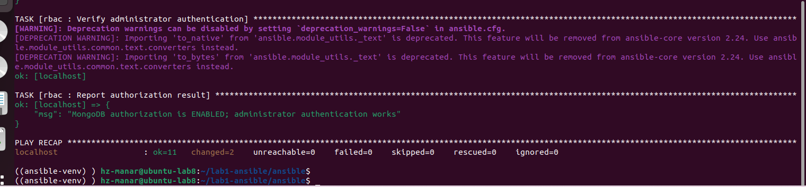

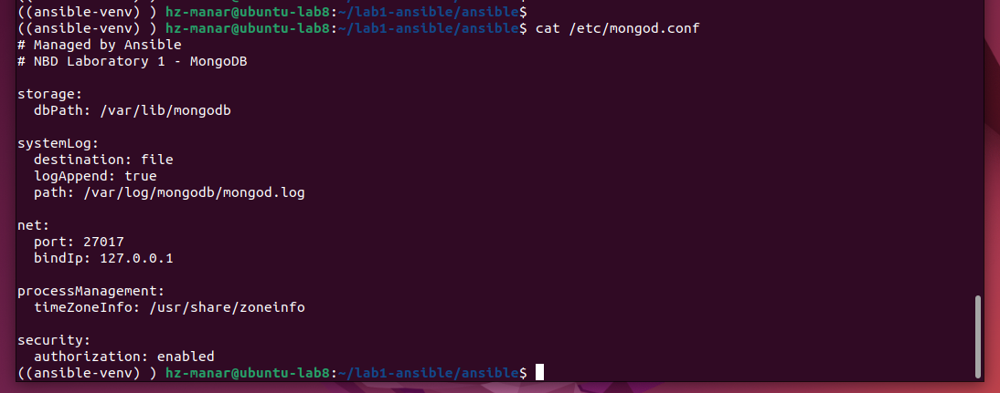

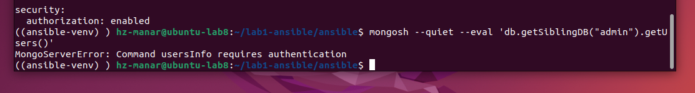

**Reading the result.** The playbook reports `Unauthenticated privileged access is DENIED` and `administrator authentication works`. I also checked from outside Ansible: a plain `mongosh` without credentials gets `MongoServerError: Command usersInfo requires authentication`. Two independent tools giving the same answer is a stronger proof than either alone. The config file now ends with `security: authorization: enabled`, the only difference from screenshot 10b.

### 4.2 Training data

Two training databases, seeded with `updateOne(..., {upsert: true})` so that rerunning the playbook does not create duplicates:

- `lab1_university_ansible`: `students`, `courses`, `grades`
- `lab1_library_ansible`: `books`

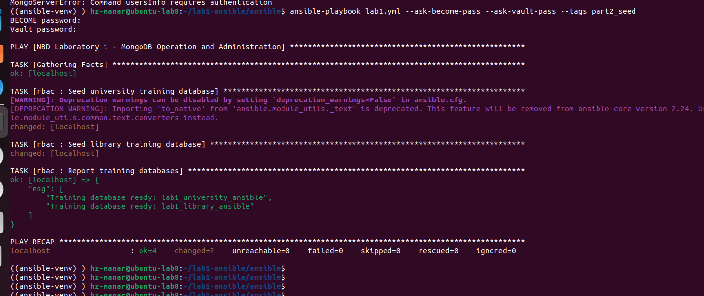

### 4.3 How the privilege model works

All results below rely on four facts about MongoDB:

- A **user** is an identity that authenticates against one database (here, always `admin`). Where a user is stored says nothing about what it can access.
- A **role** is a named set of **privileges**; a privilege is *resource + actions*, for example `{db: lab1_university_ansible, collection: ""}` + `[find]`.
- `collection: ""` means every collection in the database; `collection: "students"` means only that one.
- A user's rights are the **union** of all its roles. MongoDB has no "deny" rule, so a user is restricted only if *none* of its roles grants more.

### 4.4 Custom roles and users (2.1, 2.2)

| Role | Database | Actions | Purpose |
|---|---|---|---|
| `lab1ReaderRole` | university | `find` | read-only analyst |
| `lab1WriterRole` | university | `find`, `insert`, `update`, `remove` | application account |
| `lab1MutableRole` | university | `find` (changed in 4.7) | target for "change an existing role" |
| `lab1LibraryRole` | library | `find`, `insert`, `update` | librarian, no deletes |

| User | Role |
|---|---|
| `lab1ReaderUser` | `lab1ReaderRole` |
| `lab1WriterUser` | `lab1WriterRole` |
| `lab1LibrarianUser` | `lab1LibraryRole` |

I used custom roles instead of built-in `read`/`readWrite`. `readWrite` also includes `createIndex`, `dropCollection` and other actions an application account normally should not have. With a custom role, the exact list of actions is visible in the repository and can be changed by Ansible. User tasks use `update_password: on_create`; otherwise the module would reset each password on every run and always report `changed`, which would make the recap useless.

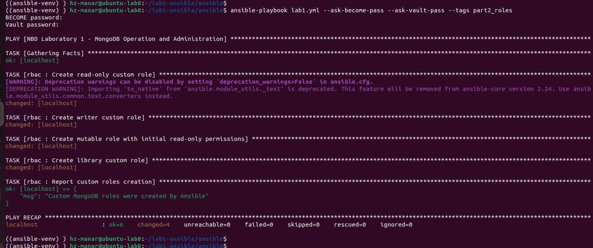

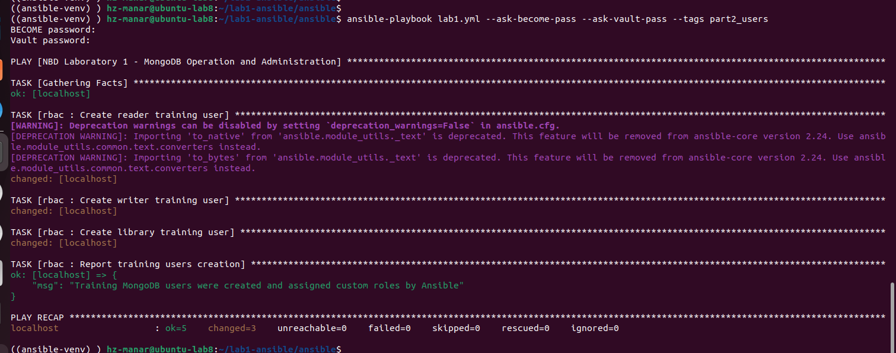

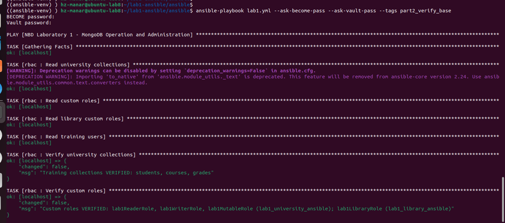

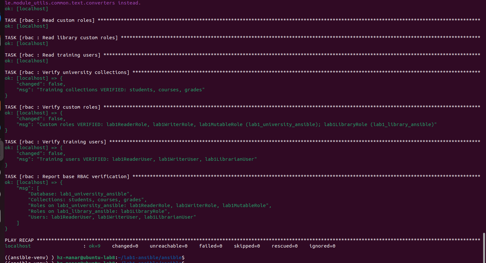

### 4.5 Proving that the roles allow different operations

Listing the roles shows how they are *defined*, not how they *behave*. So `part2_verify_permissions` logs in as each user and tries one operation its role should allow and one it should not:

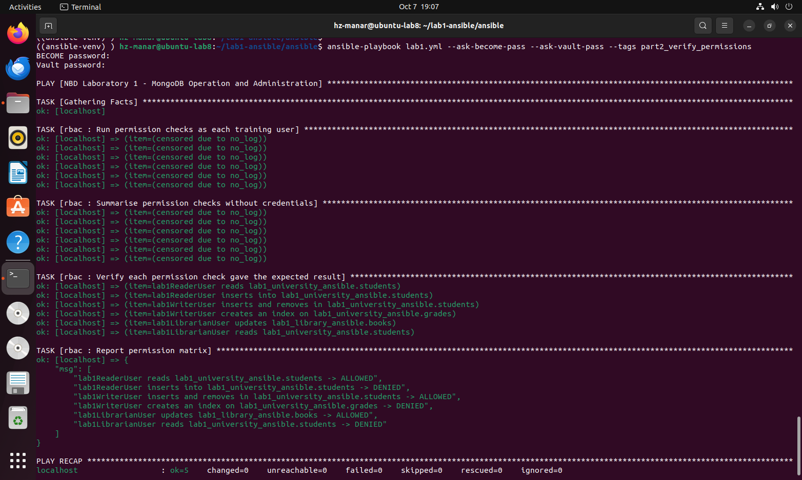

| User | Operation | Result | Why |
|---|---|---|---|
| reader | `findOne` on `students` | ALLOWED | has `find` |
| reader | `insertOne` into `students` | DENIED | no `insert` |
| writer | insert + delete in `students` | ALLOWED | has `insert` and `remove` |
| writer | `createIndex` on `grades` | DENIED | `createIndex` is not in the role, although it would be in built-in `readWrite` |
| librarian | `updateOne` on `books` | ALLOWED | has `update` on the library DB |
| librarian | `findOne` on university `students` | DENIED | the role is scoped to the library DB only |

**Reading the result.** All six match the design (`failed=0`). The two most informative rows are the denied ones for users that *do* have write access: the writer can modify data but cannot change the schema (no index), and the librarian has rights on one database but none on the other. This is the practical value of custom roles: the difference between "may change documents" and "may change the database structure" is enforced by the server, not by trusting the application.

One limitation: the script classifies *any* error as DENIED. It prints the error code (`code=13` means Unauthorized), but the check does not yet compare it, so a different error would also count as DENIED. Comparing the code is a one-line improvement. Two more details of how I wrote this test. The writer's probe document is inserted and deleted again, so the test leaves no trace. For the "forbidden" writer action I chose `createIndex` rather than something like `drop`: if the role were wrong and the action were allowed, the test would create a harmless index instead of destroying a collection. The passwords for these logins are hidden with `no_log`; the summary table is built in a separate step with only the check name and the result, so nothing secret reaches the screen.

### 4.6 Granting and revoking a role (2.3)

A separate user, `lab1GrantDemoUser`, starts with only the reader role. The grant adds the writer role, the revoke removes it, and after each step the user's role list is read back from the server.

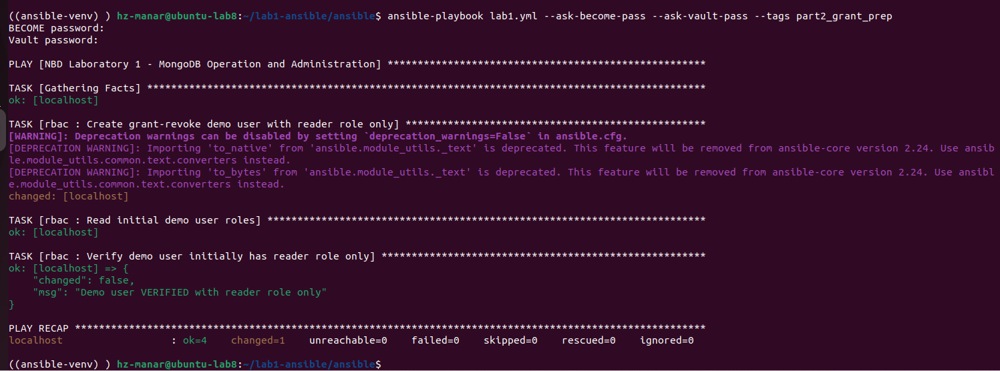

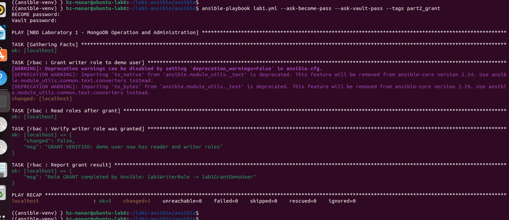

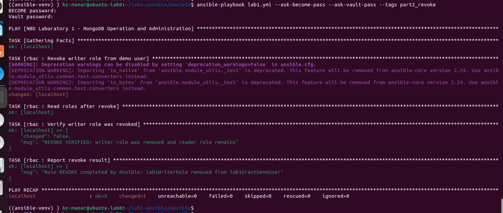

**Reading the result.** `GRANT VERIFIED: demo user now has reader and writer roles`, then `REVOKE VERIFIED: writer role was removed and reader role remains`. The revoke check tests both halves on purpose: a bug that removed *all* roles would also make "writer is gone" true. `mongodb_user` treats `roles` as the complete desired list, so revoking means listing only the roles that should remain. This is stronger than an imperative `revokeRolesFromUser`: if someone had added an extra role by hand, the next run would remove it too.

### 4.7 Changing an existing role (2.4)

`lab1MutableRole` is first reset to `find` only, then its definition is applied with `find`, `insert` and `update`. Before and after, the actual privileges are read with `rolesInfo` + `showPrivileges`.

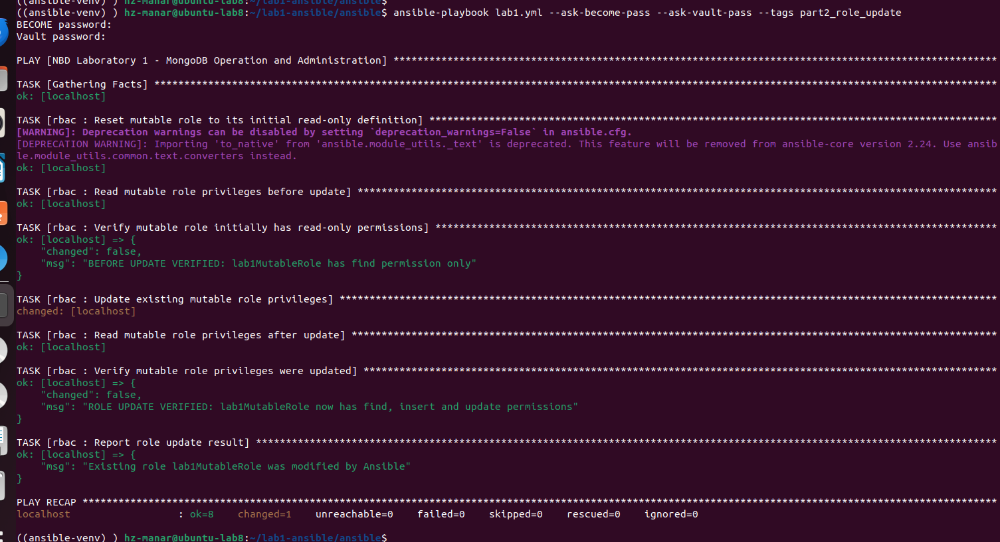

**Reading the result.** `BEFORE UPDATE VERIFIED: ... find permission only` → `ROLE UPDATE VERIFIED: ... find, insert and update`. The "before" check is what makes this a real test: if the role had been created with the final rights, the "after" check would pass with no change at all. The reset step at the start makes the tag repeatable: it can be run any number of times and always demonstrates the same transition. A change to a role applies at once to every user that holds it, without touching any user. That is the main reason to manage rights through roles: twenty application accounts sharing one role need one change, not twenty.

### 4.8 Access to one collection only (2.5)

`lab1StudentsOnlyRole` has `find` on `{db: lab1_university_ansible, collection: students}`, and `lab1StudentsUser` holds only that role. The test logs in as that user and queries two collections in the same database.

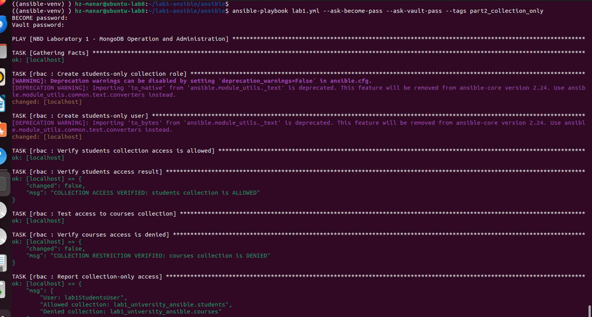

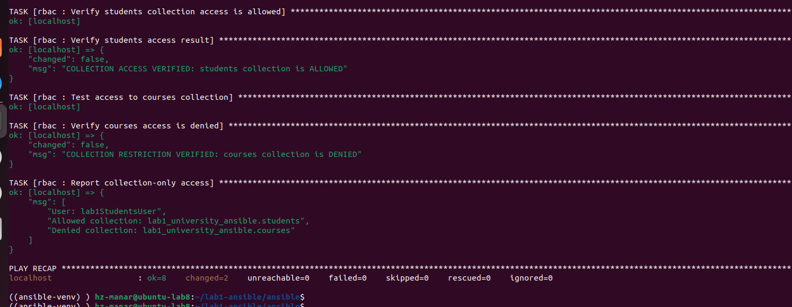

**Reading the result.** `students` is ALLOWED and `courses` is DENIED, for the same user in the same database. The denied query is the one that proves the requirement ("without opening the whole database"); the allowed one only shows the grant works. Because MongoDB has no deny rule (4.3), this restriction is fragile: it holds only while the user has no other role. If someone later gave this user `lab1ReaderRole` "for convenience", it would silently gain the whole database. That is why the negative test is part of the playbook and not a one-time manual check.

### 4.9 Deleting a role and a user (2.6)

A temporary role and user are created, checked to exist, deleted with `state: absent`, and checked to be gone.

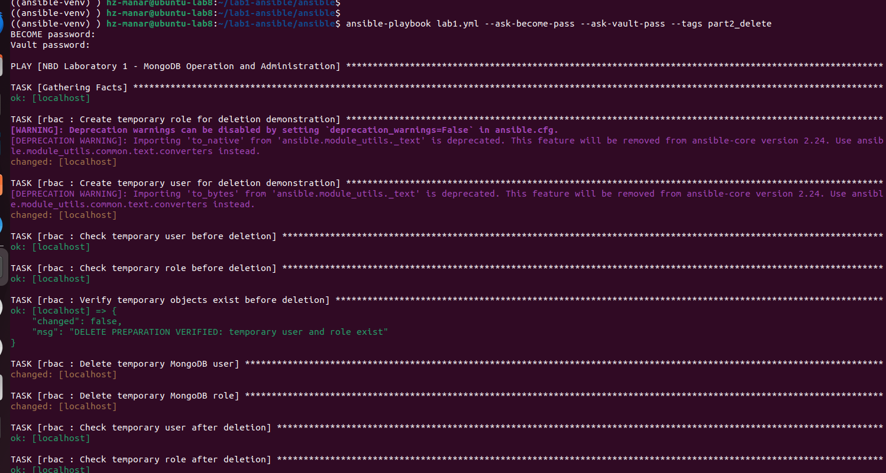

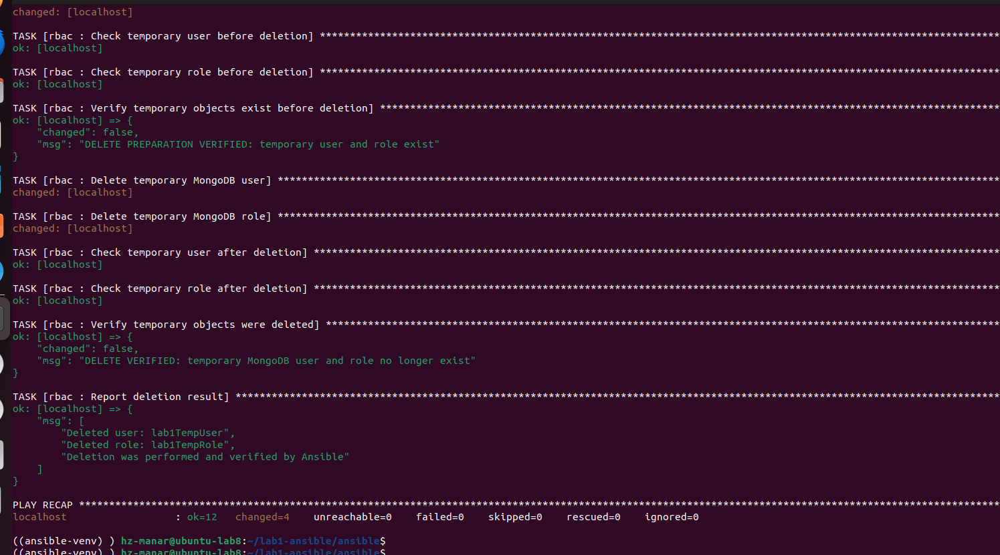

**Reading the result.** `DELETE PREPARATION VERIFIED: temporary user and role exist` → `DELETE VERIFIED: ... no longer exist`. Checking existence *before* deletion is what makes the second check meaningful: if creation had silently failed, "count is 0" would pass and prove nothing. MongoDB's `dropRole` removes a role from every user that holds it, so the order is not critical for consistency. I delete the user first anyway, so each step can be verified on its own.

---

## 5. Part 3: backup and recovery

### 5.1 How backups are made

Backups are logical, with `mongodump` and `mongorestore`, written as gzip archives to `/var/backups/mongodb/lab1_ansible`. The tools need the administrator's password. Passing it as `--password` would show it in `ps` output for as long as the dump runs, so for `mongodump` and `mongorestore` Ansible writes it to a temporary file in `/run` (tmpfs, mode 0600) and passes `--config`. The file is created and deleted inside a `block`/`always`, so it is removed even if a dump fails halfway. I want to be honest that this is not applied everywhere: the `community.mongodb.mongodb_shell` module and my own `mongosh` checks (`collection_only.yml`, `verify_permissions.yml`) still pass `--password` on the command line. Those processes live for well under a second on a single-user VM and `no_log` keeps the value out of Ansible's output, but a local user running `ps` at that exact moment could see it. On a shared server I would move those checks to a credentials file as well.

Logical backups are small and can restore a single collection, which is exactly what this part needs. The trade-off: on a standalone server without `--oplog`, a dump of several collections is not a single point-in-time snapshot. For a quiet training database that does not matter; for a busy production system I would use a replica set with `--oplog`, or filesystem snapshots.

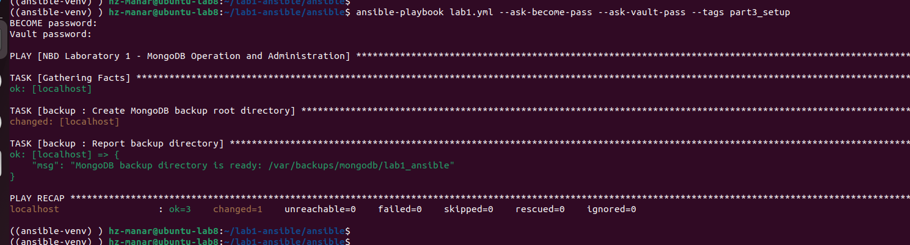

### 5.2 One database (3.1)

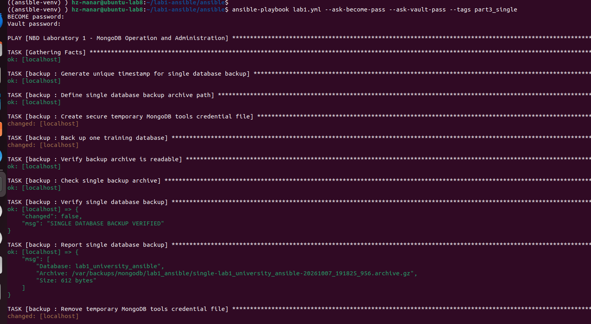

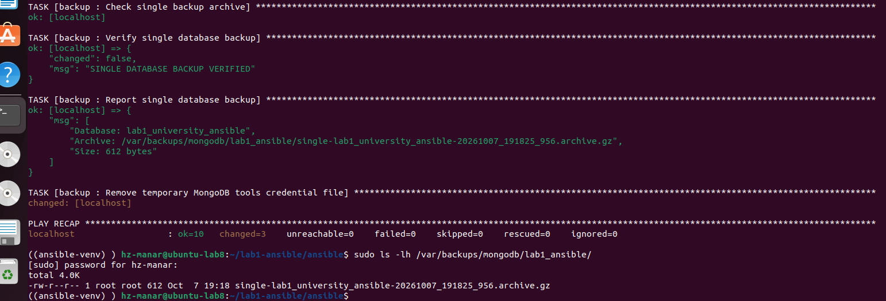

After `mongodump`, the playbook runs `mongorestore --dryRun` on the archive. A non-empty file does not prove that a backup is usable; the dry run proves the restore tool can parse it.

### 5.3 All training databases (3.2)

The role loops over the list `mongodb_training_databases` and writes one archive per database into a timestamped directory, `all-20261007_192100_596/`. I deliberately did not run a bare `mongodump` without `--db`: that would also dump `admin` and `config` (users, roles, sessions), and restoring those onto another server could conflict with its existing users and roles. "All training databases" is a list I control.

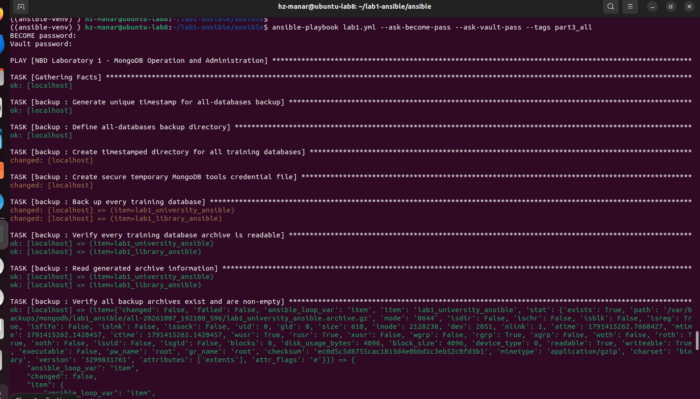

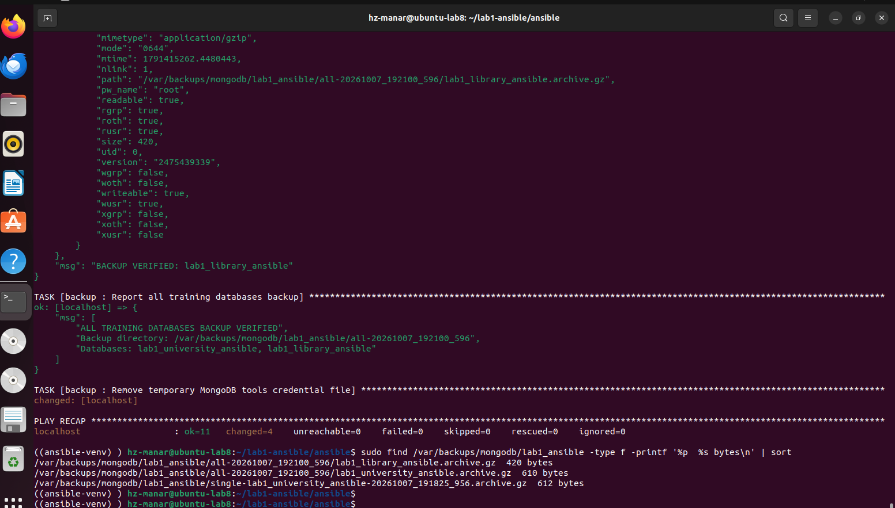

### 5.4 Several copies without overwriting (3.3)

Every file name carries a timestamp down to milliseconds. The test makes two backups in a row and asserts that both files exist independently. Then `part3_list` shows everything kept so far.

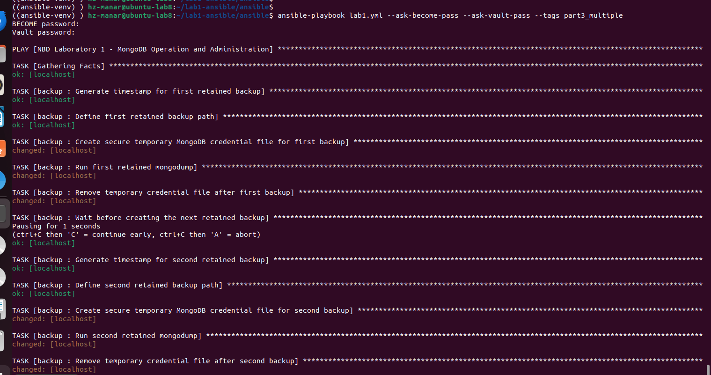

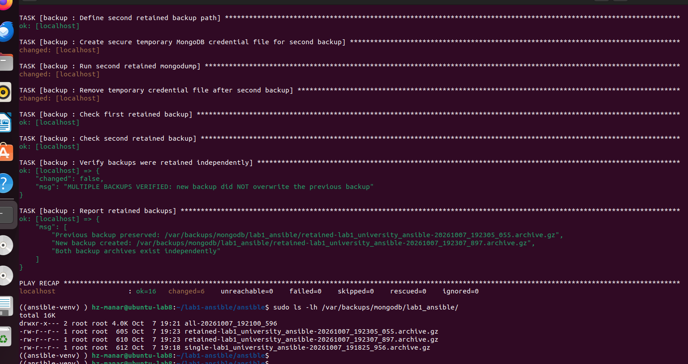

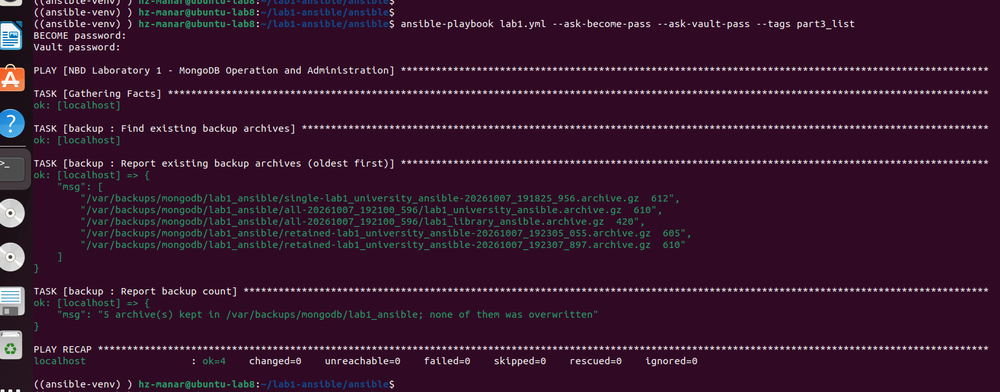

### 5.5 What the backup numbers say

| Archive | Content | Size |
|---|---|---|
| `single-…-20261007_191825_956` | university DB | 612 B |
| `all-…/lab1_university_ansible` | university DB | 610 B |
| `all-…/lab1_library_ansible` | library DB | 420 B |
| `retained-…-20261007_192305_055` | university DB | 605 B |
| `retained-…-20261007_192307_897` | university DB | 610 B |

1. **The same unchanged data gave four different sizes (605–612 B).** An archive contains more than the documents: metadata such as collection UUIDs and tool versions, and gzip output depends on the exact bytes. So archives are not byte-for-byte reproducible, and you cannot verify a backup by comparing its hash with an older one. Verification has to be semantic (can the restore tool read it, does a restore bring the data back), which is what the playbook does.
2. **The library archive is the smallest:** one collection with one document, against three collections. At this scale the size is almost entirely per-collection overhead.
3. **Two dumps 2.8 s apart** (19:23:05.055 → 19:23:07.897), including a deliberate 1 s pause. With about 1 KB of data, that time is fixed cost (Ansible task overhead, starting the tool, authenticating), not data transfer.
4. `part3_list` reports **5 archives**, oldest first, all still present. That is the direct evidence for "a new copy does not overwrite the previous one".

The archives are created as `-rw-r--r--` (0644). They are protected because the backup directory is 0750 and owned by root, so other users cannot reach them. A stricter setup would also create the files as 0600, so that copying one out of the directory would not make it readable.

### 5.6 Restore after deleting a collection (3.4)

`part3_restore` counts documents in `students`, takes a fresh backup, drops `students`, confirms it is gone, restores only that namespace with `--nsInclude`, and counts again.

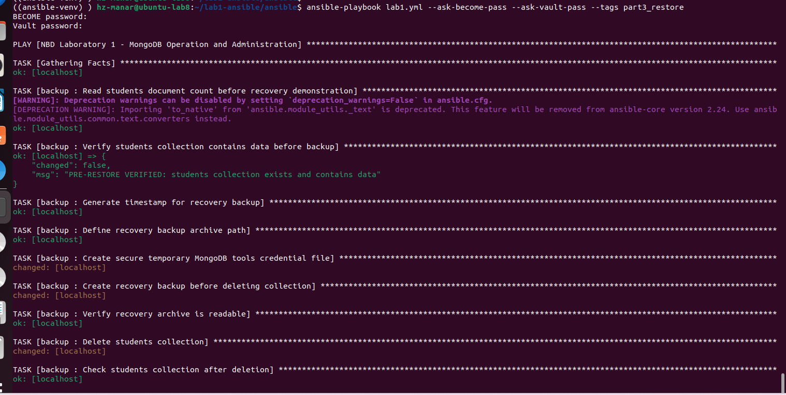

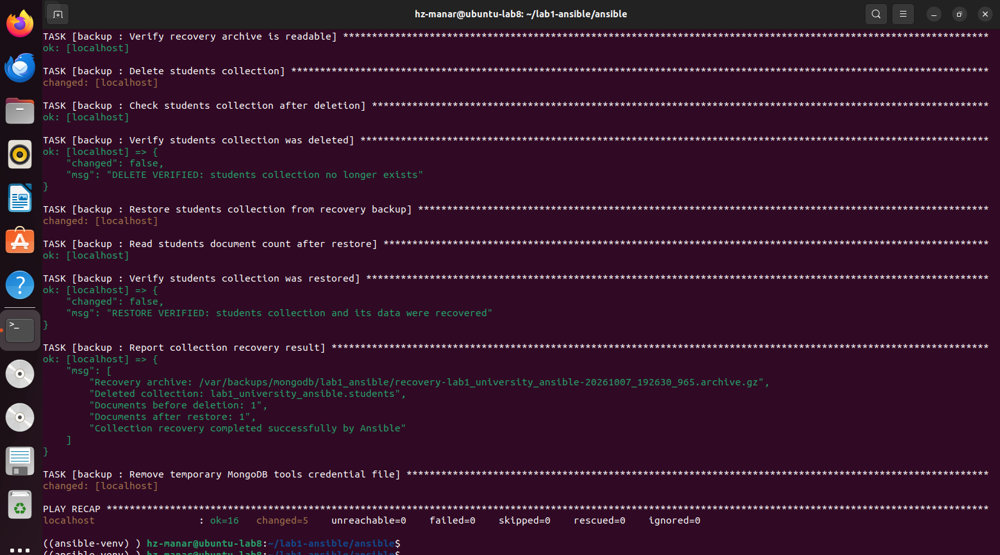

**Reading the result.** `Documents before deletion: 1` → `DELETE VERIFIED: students collection no longer exists` → `Documents after restore: 1`. The middle check is what makes this convincing: without proof that the collection was really gone, "1 document after restore" could just mean the drop never happened. `--nsInclude` restores only `students`, leaving `courses` and `grades` untouched. In a real incident, the other collections may have received new writes since the backup, and restoring them too would silently roll those writes back.

### 5.7 Restore from a chosen archive

The demo above restores from a backup it has just made. In real operations you restore from an **older** archive you choose, so I added `part3_restore_archive`, which takes the archive and the collection as parameters:

```bash
ansible-playbook lab1.yml --ask-become-pass --ask-vault-pass --tags part3_restore_archive \
  -e restore_archive=/var/backups/mongodb/lab1_ansible/single-lab1_university_ansible-20261007_191825_956.archive.gz \
  -e restore_collection=courses -e restore_drop=true
```

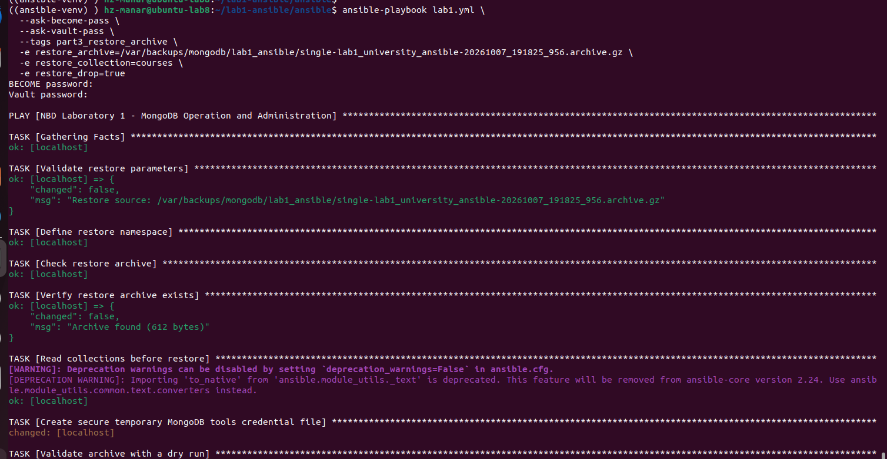

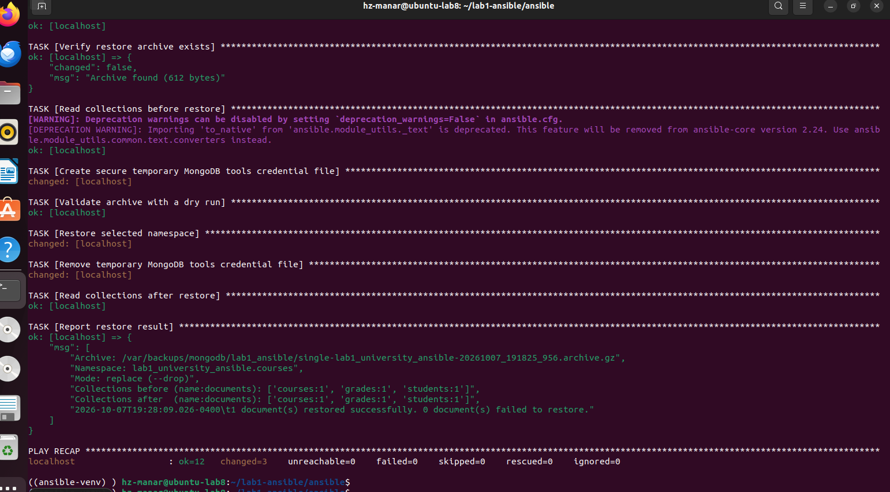

**Reading the result.** `Archive found (612 bytes)`, a dry run, then `Mode: replace (--drop)` and `1 document(s) restored successfully. 0 document(s) failed to restore.` The collection counts before and after are identical (`courses:1, grades:1, students:1`), and that is correct: `courses` was not damaged, so replacing it with the backup version changes nothing visible. The important part is the mode. By default `mongorestore` only *inserts*: documents that still exist cause duplicate-key errors and are skipped, and only missing ones come back. `--drop` replaces the collection completely with the backup version, which also discards anything written after the backup. Which one is right depends on the incident, so it is a parameter, not a fixed choice.

---

## 6. Part 4: monitoring

### 6.1 The stack

```
mongod :27017 → mongodb_exporter :9216 → Prometheus :9090 → Grafana :3000
```

All four run as systemd services, enabled at boot, listening only on `127.0.0.1`. Downloads are checked against a pinned SHA-256, so a corrupted or tampered file fails the play instead of being installed.

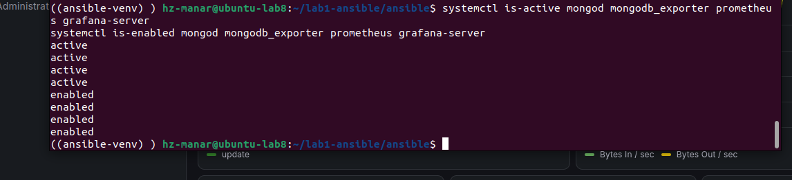

### 6.2 Monitoring user

The exporter does not log in as the administrator. `lab1Monitor` has `clusterMonitor@admin` (server status and diagnostic commands) and `read@local` (oplog metrics on a replica set; unused on this standalone server, but ready). If the exporter's credentials leaked, they would allow reading statistics, not data or users.

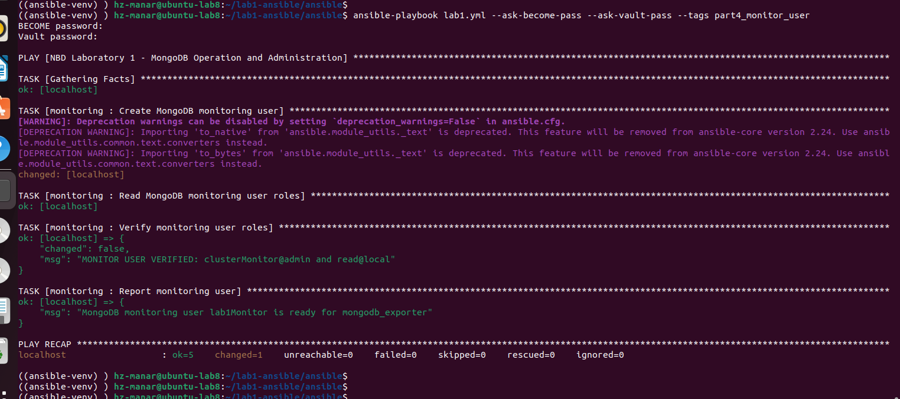

### 6.3 Exporter (4.1)

I used the Percona MongoDB Exporter with `--collect-all` (adds `dbStats`, `collStats`, `top` and index statistics on top of `serverStatus`) and `--compatible-mode` (also exports the classic `mongodb_ss_*` names that most dashboards and PromQL examples use). Credentials come from an `EnvironmentFile`, so they are not visible in the unit file or in the process arguments (screenshot 51b shows the full command line without them).

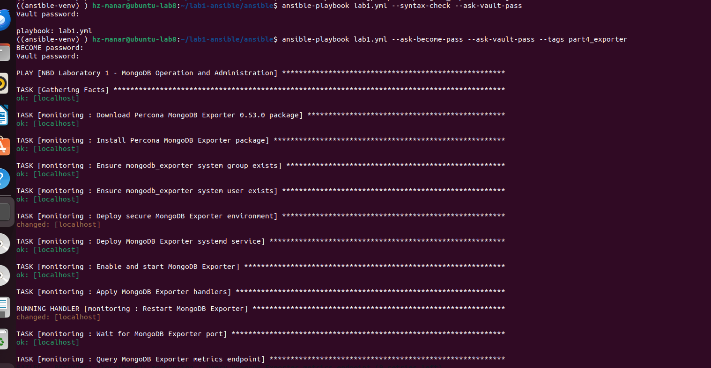

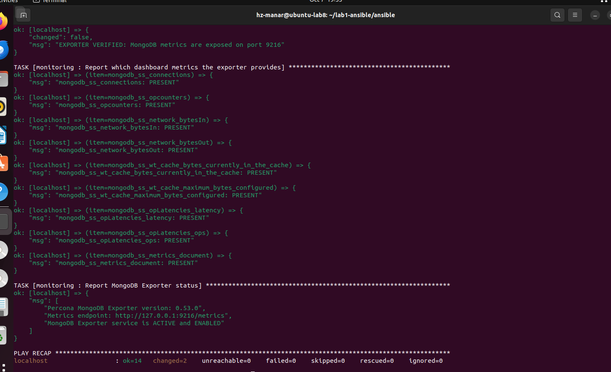

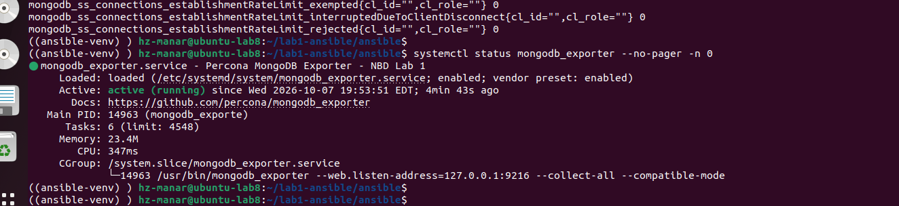

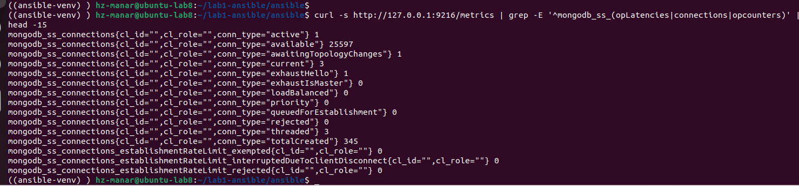

**Reading the result.** Before Grafana is even installed, the playbook checks that all nine metrics the dashboard needs are actually exported, and all nine are `PRESENT`. This check exists because of something I ran into: right after the service starts, the exporter already answers HTTP but has not yet connected to MongoDB, so a first request can return only the exporter's own metrics. A simple "does the page contain `mongodb_`" check passes even then. So the task now retries until `mongodb_ss_connections` appears, and then confirms each dashboard metric by name. An empty dashboard panel is the worst kind of monitoring failure, because it looks like "nothing is happening" rather than "something is broken".

### 6.4 Prometheus

Prometheus scrapes the exporter every 5 seconds instead of the default 15 s. The load test lasts only two minutes; at 15 s, a one-minute `rate()` window would hold only four samples. At 5 s it holds twelve. The config is validated with `promtool check config` before the service is considered ready.

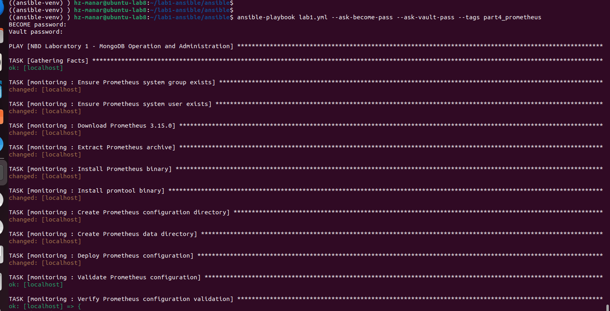

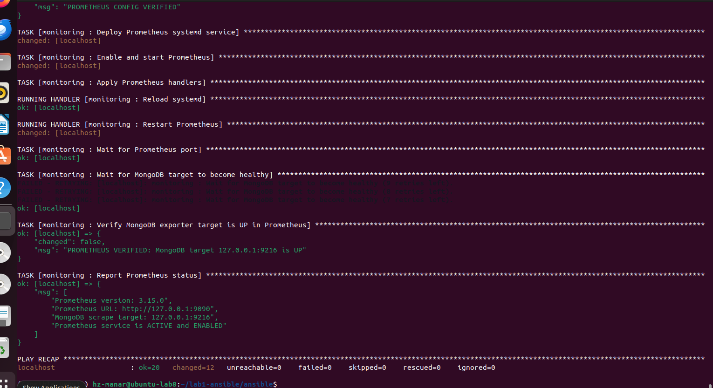

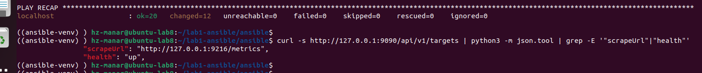

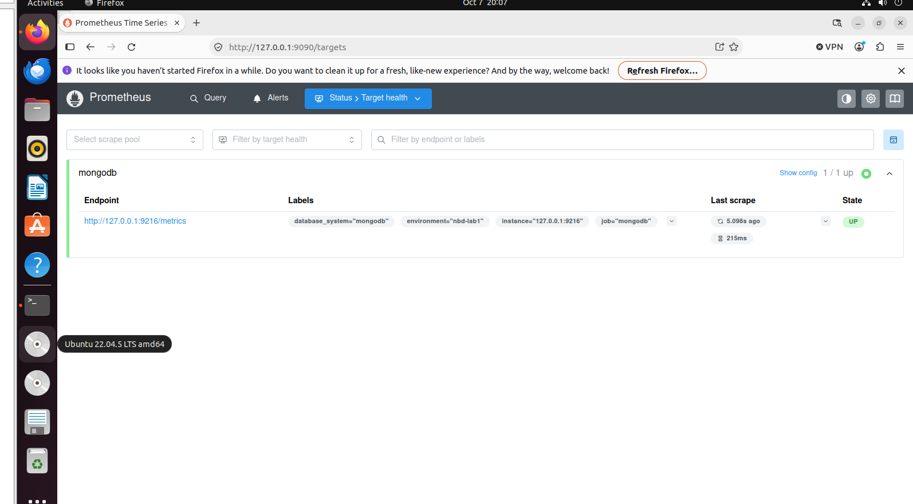

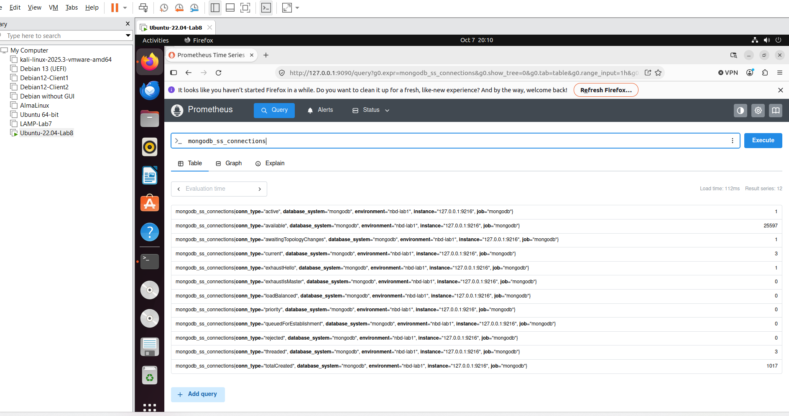

**Reading the result.** The target is `UP`, last scraped about 5 s ago, which matches the interval. The query in 54c shows that Prometheus stores real values, and it already explains a number we will see on the dashboard: `current` connections = **3**, of which `active` 1, `exhaustHello` 1 and `awaitingTopologyChanges` 1. Modern MongoDB drivers keep separate connections for streaming server monitoring next to the connection used for commands. These 3 are the exporter itself, the only client at idle.

### 6.5 Grafana and the choice of metrics (4.2, 4.3)

The datasource, dashboard provider and dashboard JSON are all provisioned from Ansible templates; I did not create any panel by clicking.

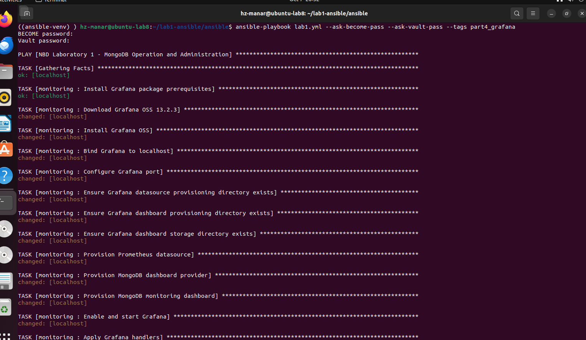

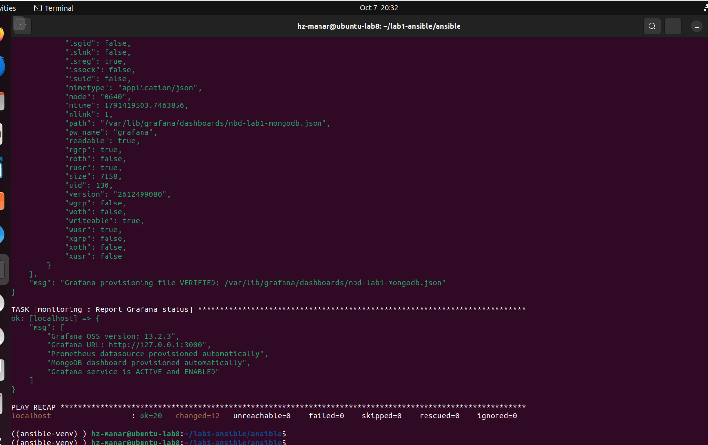

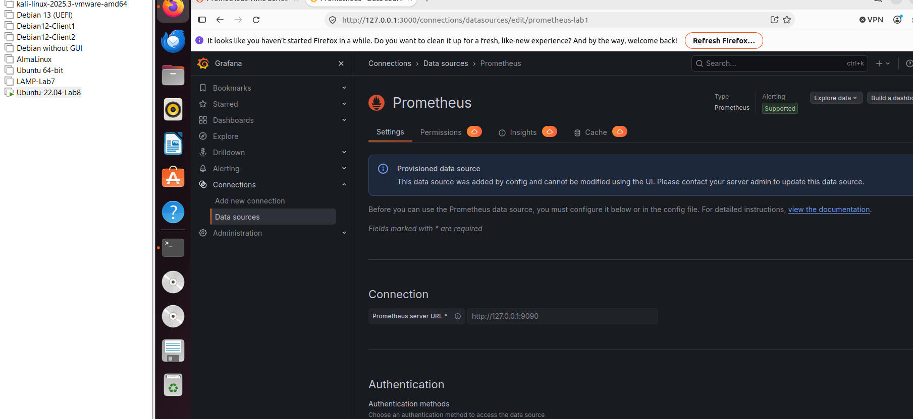

Grafana itself confirms this: *"This data source was added by config and cannot be modified using the UI."* For infrastructure-as-code, that is the desired behaviour: the repository is the single source of truth, and a manual change in the browser cannot drift away from it.

The dashboard answers the questions one asks about a database, in this order:

| Panel | Metric | Question |
|---|---|---|
| Target UP | `up{job="mongodb"}` | Can I trust the other panels? If 0, they show stale data. |
| Current Connections | `mongodb_ss_connections{conn_type="current"}` | Are clients piling up (connection leak)? |
| WiredTiger Cache | `mongodb_ss_wt_cache_bytes_currently_in_the_cache` | How much of the working set is in RAM? |
| Operations / sec | `sum by (legacy_op_type) (rate(mongodb_ss_opcounters[1m]))` | How busy is the server, and with what kind of work? |
| Network Traffic | `rate(mongodb_ss_network_bytesIn[1m])`, `rate(mongodb_ss_network_bytesOut[1m])` | How much data moves? (cross-check against payload size) |
| Operation Latency | `rate(mongodb_ss_opLatencies_latency[1m]) / rate(mongodb_ss_opLatencies_ops[1m]) / 1000` | How long does one operation take, on average, in ms? |
| Documents / sec | `sum by (doc_op_type) (rate(mongodb_ss_metrics_document[1m]))` | What happens to documents, as opposed to commands? |
| WiredTiger Cache Fill | `100 * cache bytes / mongodb_ss_wt_cache_maximum_bytes_configured` | How close is the cache to its limit? |

One cosmetic detail: the WiredTiger Cache stat is always red. That is not an alarm. I did not set thresholds for that panel, so Grafana applies its default (red above 80), and any value in bytes is above 80. Proper thresholds relative to the configured cache size would make the colour meaningful.

The first five are the minimum for "is it alive and how busy is it". I added the last three because throughput alone cannot tell "busy and fine" from "busy and slow" (latency), because commands and documents are not the same thing (section 6.8), and because raw cache bytes mean little without the limit.

### 6.6 Baseline (idle)

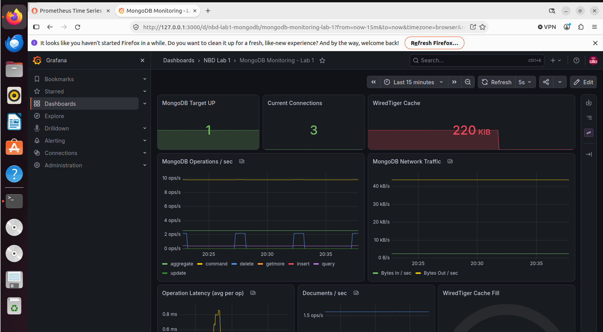

- Target up, **3** connections (the exporter, see 6.4).
- WiredTiger cache **220 KiB**.
- Operations: a flat **~10 ops/s** of `command`, and a small `delete` step of about 2 ops/s at a regular **5-minute** interval (around 20:25, 20:30 and 20:35).
- Network: about **44 kB/s out**, a few kB/s in.
- Documents/sec: a flat line at **~1.6 docs/s** returned.

The idle database is not silent, and that is worth understanding before running the load:

- **The ~10 commands/s and the lopsided traffic** (small requests, large responses) are the exporter itself. Every 5 seconds it sends a handful of diagnostic commands (`serverStatus`, `dbStats`, `collStats`, …) and gets large documents back. The monitoring system is a client of the database, and its cost is visible on its own dashboard.
- **The periodic `delete` steps** have a 5-minute period, which matches MongoDB's logical session cache: by default it refreshes every 300 s (`logicalSessionRefreshMillis`) and cleans up records of expired sessions. Every `mongosh` call from Ansible opens a session, so there are expired sessions to clean up. I did not verify this directly (for example by changing the refresh interval), so I treat it as the explanation that fits the evidence, not a proven fact.

So "zero" on these graphs really means about 10 ops/s and 44 kB/s of background activity, and that is the baseline for the load.

### 6.7 The load generator (4.4)

A small Python script (PyMongo, from the same virtualenv) runs as a systemd unit for 120 s. It logs in as `lab1WriterUser`, not as the administrator, which also exercises the part 2 roles in practice. In batches of 20 iterations with a 50 ms pause between batches, each iteration does:

- `update_one` with `upsert=True` on `_id = counter % 2000`, writing a 4 KiB string;
- `find_one` on the same `_id`;
- every fifth iteration, `delete_one` on `_id + 1000` (mod 2000).

Limiting `_id` to 2000 values keeps the collection from growing; it is a rewrite-heavy workload on a fixed set of documents.

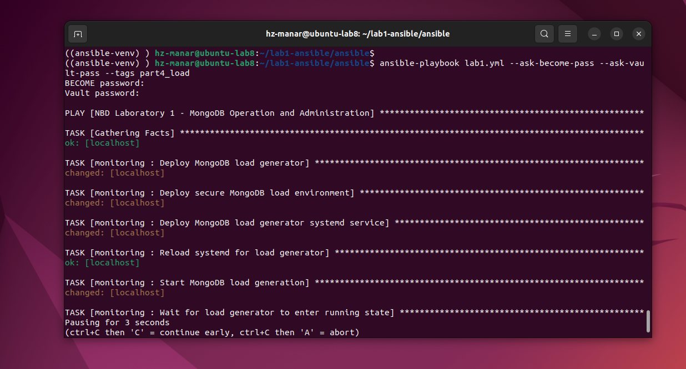

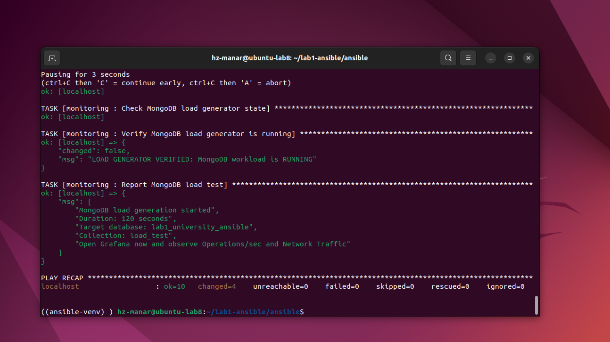

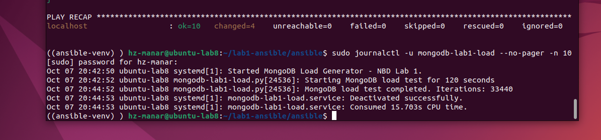

The journal shows the run from **20:42:52 to 20:44:52** with **33,440 iterations**, which is **278.7 iterations/s**. The service used 15.7 s of CPU, about 13% of one core.

### 6.8 Reading the graphs under load

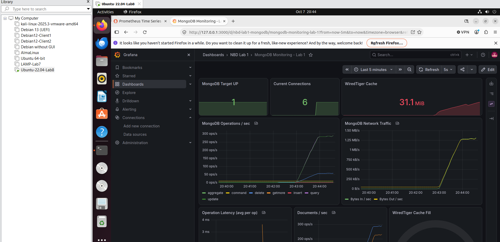

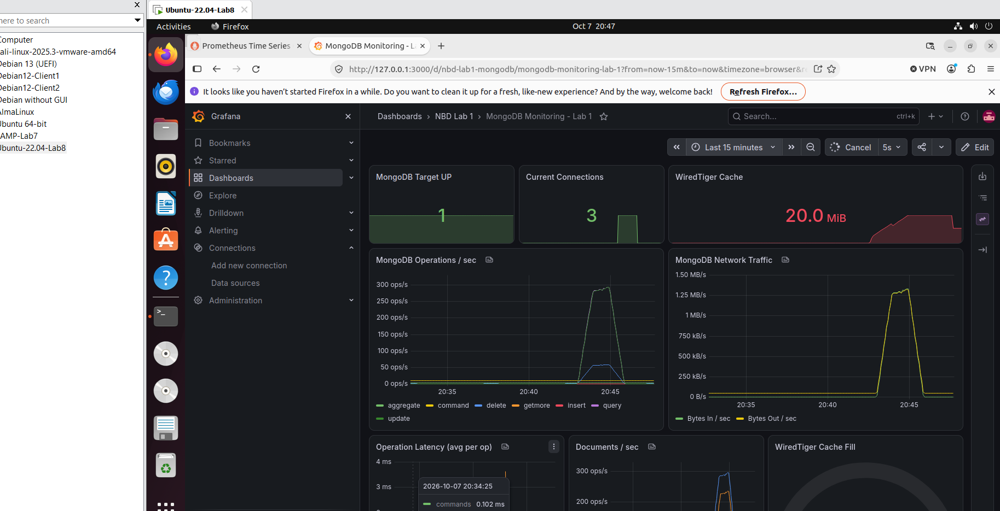

Before looking at the graphs I worked out what they *should* show from the script, then compared. That is the difference between "the graph went up" and understanding the graph.

**Operations: predicted vs observed**

| Series | Prediction | Observed |
|---|---|---|
| `update` | 1 per iteration → ~279/s | ~280/s |
| `query` | 1 per iteration → ~279/s | ~280/s (on top of `update`) |
| `delete` | 0.2 per iteration → ~56/s | ~55/s |
| `insert` | — | ~0 |
| `command` | unchanged (exporter) | ~10/s, unchanged |
| `getmore` | 0 | 0 |

All match. Two of them are not obvious:

- **`insert` stays at zero although documents are created all the time.** Every delete removes a document that an upsert re-creates about 1000 iterations later. But an upsert is an *update command* that happens to insert, and `opcounters` count commands, not what they did to the data. Someone reading this panel alone would conclude "nothing is being inserted", and they would be wrong.
- **`getmore` stays at zero** because `find_one` has limit 1 and always fits in the first batch.

**Documents / sec resolves the `insert` puzzle.** This panel counts what happened to documents, not commands. The two upper lines plateau at about **285/s** and **~230/s**. ~285 is `returned`: one document per `find_one` (278.7/s) plus the ~1.6/s background seen at idle. ~230 is `updated`: of the ~279 upserts per second, about 50 hit a document that had been deleted, so they count as `inserted` instead of `updated`, and 279 − ~50 ≈ 230. The `inserted` and `deleted` lines should then be around 50/s each. The gap between `update` commands (~280) and `updated` documents (~230) is exactly the hidden inserts. This is why I added this panel: commands and documents tell two different stories, and you need both.

**Network.** Each update sends a 4 KiB document and each `find_one` returns it. The panel plateaus at about **1.27 MB/s in both directions**, the two lines almost on top of each other. 1.27 MB/s ÷ 278.7 iterations/s ≈ 4.6 KB per iteration per direction: the 4,096-byte payload plus about 0.5 KB of BSON field names, command envelope and wire-protocol headers. The symmetry is what a write-then-read loop should produce, the opposite of the idle baseline, where outgoing traffic was more than ten times the incoming.

**Connections went from 3 to 6.** The load generator is one `MongoClient`, but like the exporter it opens a connection for commands plus its own monitoring connections. 3 (exporter) + 3 (load client) = 6, and back to 3 after the run (screenshot 60). So a single application instance costs about three server connections, which matters when sizing connection limits for many instances.

**Latency.** At idle, the average command latency is about **0.1 ms** (the tooltip in screenshot 60 shows 0.102 ms at 20:34:25). Under load there is one short spike to about **3.5 ms** at the very start of the run, after which the line drops back down. My reading: the first writes created the `load_test` collection and its storage files, which is far more expensive than a normal upsert, and the one-minute average makes that single expensive moment visible.

**Ramp shape.** All series take about a minute to climb to their plateau, although the load started at full rate. That slope comes from `rate(...[1m])`, which averages over a one-minute window, so a step in the real rate is drawn as a one-minute ramp. The same smoothing explains the slow decline after 20:44:52. A shorter window would show the step more sharply but would be noisier; the shape of a graph depends partly on the query that draws it.

**Cache.** WiredTiger went from **220 KiB** at idle to **31.1 MiB** under load, then down to **20.0 MiB** after the run. The live data is small (2,000 documents × ~4 KiB ≈ 8 MiB), so 31 MiB is several times the data. My explanation: with constant rewrites of the same documents, WiredTiger keeps older versions in memory for concurrency control (MVCC), plus dirty pages waiting for the next checkpoint. When the load stops, those versions and dirty pages are cleaned up and the cache settles closer to the real working set, which is why it dropped to 20 MiB rather than staying at the peak. The Cache Fill panel puts this in perspective: by default WiredTiger may use 50% of (RAM − 1 GB), so on this 4 GB VM the limit is around 1.5 GB, and ~31 MiB is about 2% of it. There was no eviction pressure at all.

**Availability.** `up` stayed at 1 throughout.

**What the load actually measured.** The script sleeps 50 ms per batch of 20 iterations: 1,672 batches × 50 ms = 83.6 s of a 120 s run, so it was asleep about 70% of the time. The remaining ~36 s covered 33,440 iterations, about 1.1 ms per iteration (three operations, including client overhead). So ~279 iterations/s was the pace set by the script, not a limit of MongoDB. This was a paced workload, not a saturation benchmark. For this lab that is the right choice: because the expected values can be calculated in advance, the dashboard can be checked against them, which is how I know it measures the right thing.

### 6.9 What I would conclude if this were a real server

At about 600 operations per second (280 updates + 280 queries + 55 deletes + ~10 background commands), the monitored metrics showed no obvious sign of strain: connections grew only by the new client, the cache used about 2% of its limit, latency had only a short spike at the start, the target never went down, and throughput was exactly what the client asked for. The test was paced by the client's own sleep, so it did not try to find MongoDB's limit, and these eight panels cannot rule out problems they do not measure.

---

## 7. Practical limits

- **The datasets are tiny.** Restores are verified by collection presence and document counts. For real data I would add content checks, for example `dbHash` or sampled documents.
- **Backups are local to the VM.** A real policy would copy archives to independent storage, delete old copies automatically, and run on a schedule.
- **Users and roles are not in the data backups.** They live in `admin`, and the backups are scoped to the training databases. Access control is recreated from the `rbac` role, so data recovery and RBAC recovery are intentionally separate paths.
- **Standalone server.** Replication lag, the oplog window, point-in-time recovery and consistent multi-collection dumps (`--oplog`) are outside this lab.
- **Part 2 is written around named demo objects.** Grant, revoke, role update and deletion work on users and roles whose names come from `group_vars` (they can be overridden with `-e`, for example `-e mongodb_grant_demo_user=...`), and the deletion task removes a temporary user it creates itself. Part 1 (`mongodb_service_action`) and part 3 (`restore_archive`) already take parameters. The next step for part 2 would be the same style: `-e rbac_user=... -e rbac_role=...` for grant, revoke and delete of any existing object.
- **MongoDB version is not pinned.** `state: latest` within the 9.0 series means a later run could upgrade the server (and restart it). For reproducibility I would pin `mongodb-org=9.0.2`.
- **Host tuning beyond the requirements.** The playbook prepares the host for MongoDB (packages, repository and signing key, configuration, service). OS-level tuning from the MongoDB production notes (swappiness, `max_map_count`, time synchronisation) was not required here and would be a separate `host_prep` task file on a real server.
- **Backups run as the administrator.** The exporter has its own least-privilege user, and backups should too: a user with the built-in `backup` and `restore` roles instead of `root`.
- **Some tags are demonstrations, and a full run includes them.** `part3_restore` backs up, drops and restores `students`, and `part4_load` generates two minutes of traffic. Both are self-contained (the collection ends up as it was), so I left them in the default run to keep "one command runs the whole lab" true. Only `part1_service`, `part1_service_demo` and `part3_restore_archive` carry the `never` tag, so a full run never stops the database or restores from an arbitrary archive. On a real server I would mark the two demos `never` as well, so they run only when asked by name.

## 8. Running it

```bash
# prerequisites (once): Python 3.12 + Ansible on the control node (Ubuntu 22.04)
sudo add-apt-repository -y ppa:deadsnakes/ppa
sudo apt install -y python3.12 python3.12-venv
python3.12 -m venv ~/ansible-venv && source ~/ansible-venv/bin/activate
pip install ansible-core==2.21.5        # the version this lab was tested with

cd ansible
ansible-galaxy collection install -r requirements.yml

# first time only: create the secrets file
cp group_vars/all/vault.yml.example group_vars/all/vault.yml   # fill in the passwords
ansible-vault encrypt group_vars/all/vault.yml

# whole lab in one run (everything except the tags marked "never")
ansible-playbook lab1.yml --ask-become-pass --ask-vault-pass

# one part at a time
ansible-playbook lab1.yml --ask-become-pass --ask-vault-pass --tags part1
ansible-playbook lab1.yml --ask-become-pass --ask-vault-pass --tags part2
ansible-playbook lab1.yml --ask-become-pass --ask-vault-pass --tags part3
ansible-playbook lab1.yml --ask-become-pass --ask-vault-pass --tags part4

# service control (start | stop | restart | status)
ansible-playbook lab1.yml --ask-become-pass --ask-vault-pass --tags part1_service -e mongodb_service_action=restart

# restore from a chosen archive
ansible-playbook lab1.yml --ask-become-pass --ask-vault-pass --tags part3_restore_archive \
  -e restore_archive=/var/backups/mongodb/lab1_ansible/<archive>.archive.gz \
  -e restore_collection=students -e restore_drop=true
```

Narrower tags run single operations, in order: `part2_bootstrap_admin`, `part2_enable_auth`, `part2_seed`, `part2_roles`, `part2_users`, `part2_verify_base`, `part2_verify_permissions`, `part2_grant_prep`, `part2_grant`, `part2_revoke`, `part2_role_update`, `part2_collection_only`, `part2_delete`, `part3_single`, `part3_all`, `part3_multiple`, `part3_list`, `part3_restore`, `part4_monitor_user`, `part4_exporter`, `part4_prometheus`, `part4_grafana`, `part4_load`. Each assumes the earlier parts are already applied.

## 9. Requirement coverage

| # | Requirement | Where | Evidence |
|---|---|---|---|
| 1.1 | Prepare the host and deploy MongoDB (no Docker) | `part1_setup` | 10, 10b, 10c, 12 |
| 1.2 | Automatic start after a reboot | `part1_setup`, `part1_autostart_check` | 13 (real reboot) |
| 1.3 | Start, stop, restart | `part1_service` | 14, 15, 16, 17 |
| 1.4 | Check availability and report the result | `part1_health` | 11 |
| 2.1 | Users for the training databases | `part2_users` | 25, 26 |
| 2.2 | Custom roles with different sets of operations | `part2_roles`, `part2_verify_permissions` | 24, 26, 27 |
| 2.3 | Grant and revoke roles | `part2_grant`, `part2_revoke` | 28, 29, 30 |
| 2.4 | Change permissions of an existing role | `part2_role_update` | 31 |
| 2.5 | Access to one collection only | `part2_collection_only` | 32 |
| 2.6 | Delete a role and a user | `part2_delete` | 33 |
| 3.1 | Back up one training database | `part3_single` | 41 |
| 3.2 | Back up all training databases | `part3_all` | 42 |
| 3.3 | Several copies, no overwriting | `part3_multiple`, `part3_list` | 43, 44 |
| 3.4 | Restore after deleting a collection | `part3_restore`, `part3_restore_archive` | 45, 46 |
| 4.1 | Existing exporter configured | `part4_monitor_user`, `part4_exporter`, `part4_prometheus` | 50–54 |
| 4.2 | Useful metrics chosen | section 6.5 | 51 (all metrics present) |
| 4.3 | Dashboard | `part4_grafana` | 55, 56 |
| 4.4 | Load and its effect on the graphs | `part4_load` | 57–60 |
| — | Teacher's request: everything automated, one playbook | `lab1.yml` | 07, 08 |

## Conclusion

The hardest part of this lab was not MongoDB itself but getting the order right: Python 3.12 next to the system Python, PyMongo in its own virtualenv, the administrator before authorization, Jinja and Grafana fighting over the same curly braces in the dashboard template (solved with ``), and an exporter that answers before it has connected to the database. Each of these broke at least once before it worked, and each fix is now a line in the playbook, so it will not break the same way twice.

What I take away is the pattern I ended up using everywhere: **change → read back → assert**. For the important administrative steps, the playbook does not trust that a command worked; it asks the server. The monitoring part taught me a second habit: work out what a graph *should* show before looking at it. When prediction and graph agreed (279 vs ~280 ops/s, ~4.6 KB per operation), I knew the dashboard measured the right thing. When they seemed not to (`insert` at zero while documents were clearly being created), the mismatch taught me something real about how MongoDB counts operations, and adding the Documents/sec panel turned that puzzle into a check.
