# Lab 1 — MongoDB Operation and Administration

## What I did

For this lab I deployed MongoDB directly on an Ubuntu virtual machine in VMware Workstation, without Docker. The work was split into the four parts from the task: basic service setup, role-based access control, backup/restore, and monitoring.

I automated the repeated operations with scripts and kept the final configuration files in the repository. The screenshots below are from the VM where I tested the scripts.

### Environment

| Component | Version / setup |
|---|---|
| OS | Ubuntu 22.04.5 LTS (Jammy Jellyfish) |
| Virtualization | VMware Workstation |
| Docker | Not used |
| MongoDB Community Server | 9.0.2 |
| mongosh | 2.12.0 |
| MongoDB Database Tools | 100.19.1 |
| Percona MongoDB Exporter | 0.53.0 |
| Prometheus | 3.15.0 |
| Grafana OSS | 13.2.3 |

I did not commit passwords. MongoDB scripts use `passwordPrompt()` or an interactive password prompt. The exporter password is stored only on the VM in a protected file.

---

## Repository layout

```text
lab1/
├── README.md
├── configs/
│   ├── grafana-dashboard.json
│   ├── mongod.conf
│   ├── mongodb_exporter.service
│   ├── prometheus.service
│   └── prometheus.yml
├── screenshots/
│   ├── 01-system-info.png
│   ├── ...
│   └── 41-load-test-completed.png
└── scripts/
    ├── install_mongodb.sh
    ├── mongodb_service.sh
    ├── check_mongodb.sh
    ├── create_test_data.js
    ├── create_admin.js
    ├── create_roles.js
    ├── create_users.js
    ├── assign_role.js
    ├── revoke_role.js
    ├── update_role.js
    ├── create_collection_role.js
    ├── create_students_user.js
    ├── delete_user_role.js
    ├── create_second_database.js
    ├── backup_database.sh
    ├── backup_all_databases.sh
    ├── restore_students.sh
    ├── create_monitor_user.js
    ├── install_mongodb_exporter.sh
    ├── setup_mongodb_exporter_service.sh
    ├── install_prometheus.sh
    ├── install_grafana.sh
    └── generate_load.js
```

I kept one script per administrative task. It was easier to rerun a specific operation and to see exactly what each script was responsible for.

---

# Part 1 — Basic MongoDB setup

## 1.1 VM and OS check

Before installation I checked the OS version:

```bash
cat /etc/os-release
```

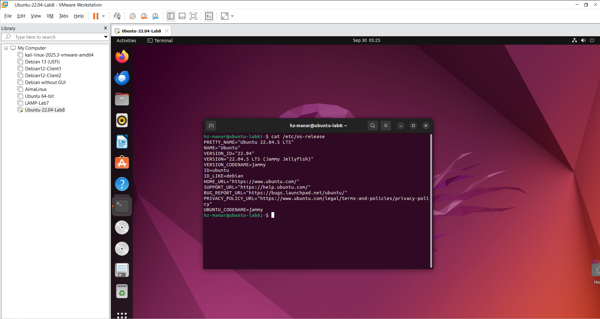

The VM was running Ubuntu 22.04.5 LTS, so I used the MongoDB repository for Ubuntu 22.04.

## 1.2 MongoDB installation

Installation is automated in `scripts/install_mongodb.sh`:

```bash
cd ~/lab1/scripts
chmod +x install_mongodb.sh
./install_mongodb.sh
```

The script adds the MongoDB 9.0 repository, installs `mongodb-org`, enables `mongod`, starts the service, and prints the installed version.

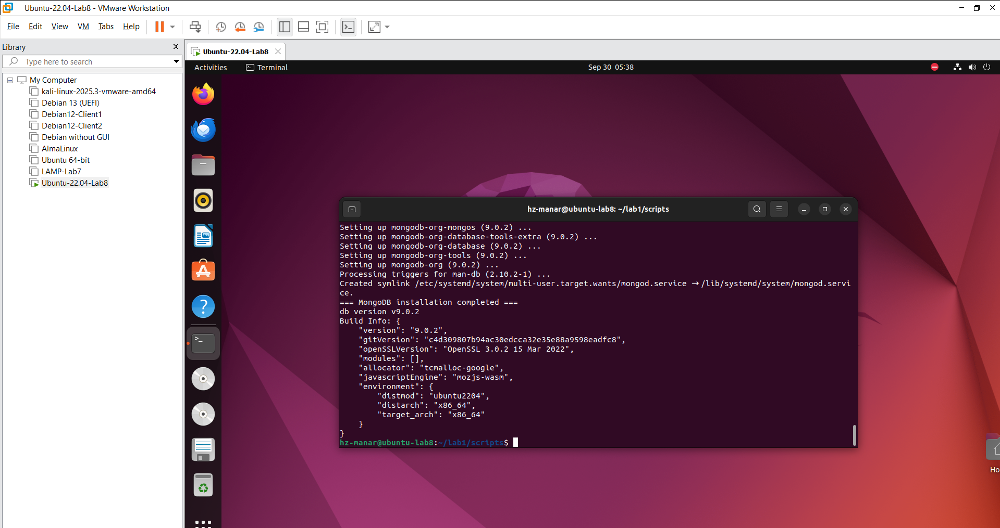

The installed MongoDB version was 9.0.2.

## 1.3 Autostart after reboot

I checked both the current service state and the systemd autostart state:

```bash
systemctl is-active mongod
systemctl is-enabled mongod
```

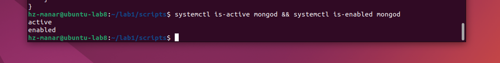

The output was `active` and `enabled`. I checked both because a running service is not necessarily configured to start after reboot.

## 1.4 Start, stop, and restart

I used `mongodb_service.sh` for the service lifecycle.

Stop:

```bash
./mongodb_service.sh stop
systemctl is-active mongod
```

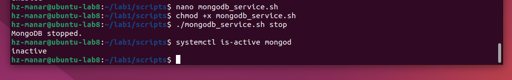

Restart:

```bash
./mongodb_service.sh restart
systemctl is-active mongod
```

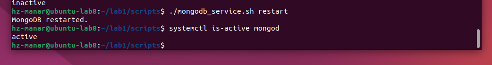

Start:

```bash
./mongodb_service.sh start
systemctl is-active mongod
```

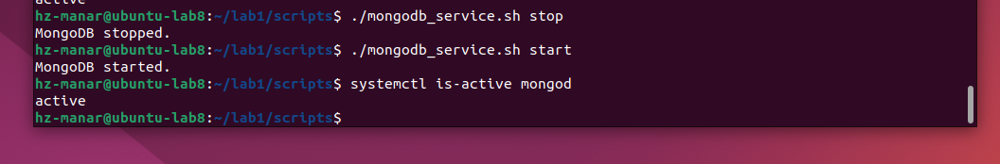

All three paths worked as expected.

## 1.5 Availability check

For the health check I did not rely only on systemd. `check_mongodb.sh` checks the service and then sends a real MongoDB ping:

```bash
./check_mongodb.sh
```

The two checks used by the script are:

```bash
systemctl is-active --quiet mongod
mongosh --quiet --eval 'db.adminCommand({ ping: 1 })'
```

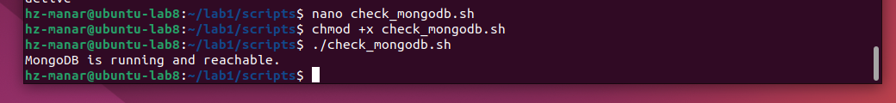

This way the script reports success only when `mongod` is running and the server actually answers a request.

---

# Part 2 — Users and role model

## 2.1 Training database

I created a small `university` database with three collections:

```text
students
courses
grades
```

The data is created by:

```bash
mongosh --file create_test_data.js
```

The seed script uses `updateOne(..., { upsert: true })`, so rerunning it does not keep adding duplicate seed records.

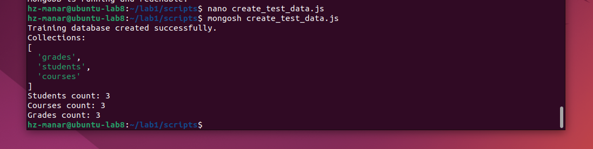

I kept this dataset small because it is used mainly for permissions and restore tests.

## 2.2 Administrative user and authorization

Before enabling authorization I created the administration account:

```bash
mongosh --file create_admin.js
```

The script creates `labAdmin` in the `admin` database and asks for the password interactively.

```javascript
db = db.getSiblingDB("admin");

db.createUser({
  user: "labAdmin",
  pwd: passwordPrompt(),
  roles: [
    { role: "userAdminAnyDatabase", db: "admin" },
    { role: "readWriteAnyDatabase", db: "admin" }
  ]
});
```

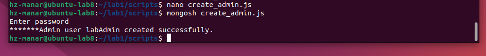

I created this account first so that I would not lock myself out after enabling authorization.

Then I enabled authorization in `/etc/mongod.conf`:

```yaml
security:
  authorization: enabled
```

The final config is also saved as `configs/mongod.conf`.

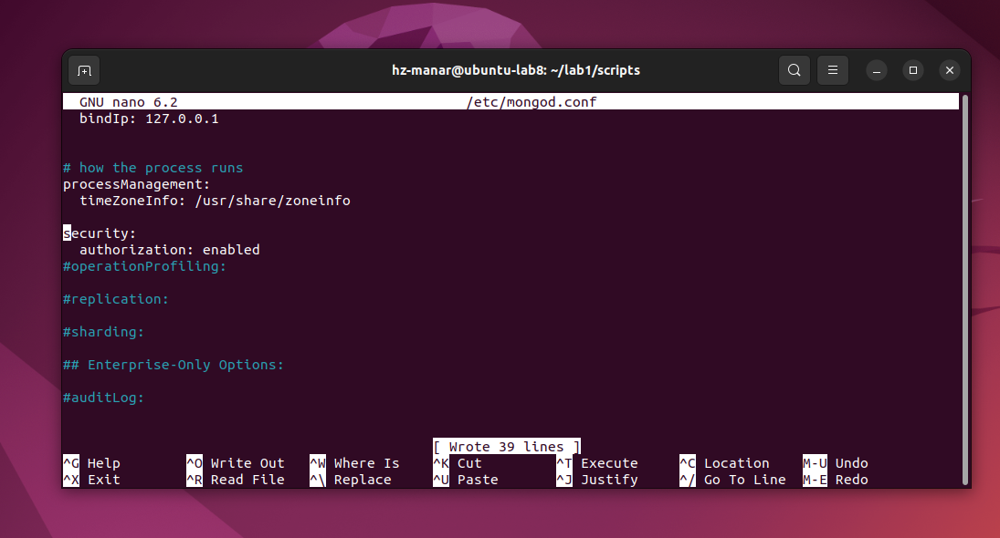

After changing the configuration:

```bash
sudo systemctl restart mongod
```

## 2.3 Authentication check

First I tried to query `university.students` without credentials:

```bash
mongosh --quiet --eval 'db.getSiblingDB("university").students.findOne()'
```

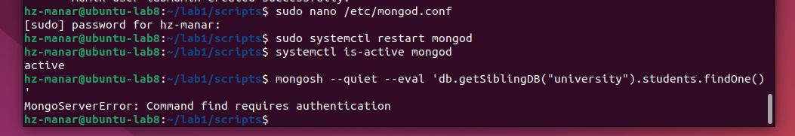

The request was rejected, which confirmed that authorization was being enforced.

Then I logged in as `labAdmin` and repeated a query:

```bash
mongosh --username labAdmin --authenticationDatabase admin --password
```

```javascript
use university
db.students.findOne()
```

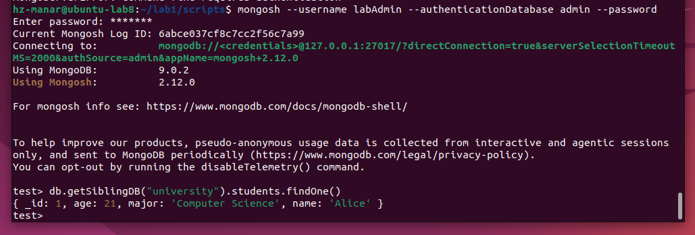

The authenticated request worked.

## 2.4 Custom roles

I created two custom roles with `create_roles.js`:

```text
universityReader
universityWriter
```

Their main actions are:

```javascript
// universityReader
actions: ["find"]

// universityWriter
actions: ["find", "insert", "update"]
```

I ran the script as `labAdmin`:

```bash
mongosh \
  --username labAdmin \
  --authenticationDatabase admin \
  --password \
  --file create_roles.js
```

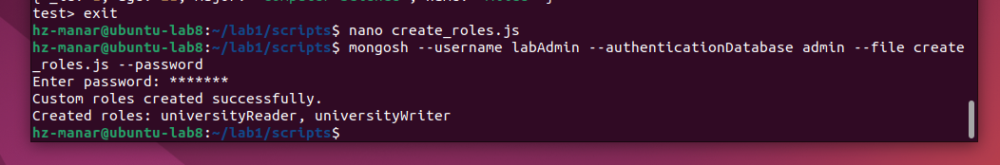

Using custom roles made it possible to demonstrate exactly which operations were allowed.

## 2.5 Users with different permissions

I created `readerUser` and `writerUser` with `create_users.js`:

```text
readerUser -> universityReader
writerUser -> universityWriter
```

```bash
mongosh \
  --username labAdmin \
  --authenticationDatabase admin \
  --password \
  --file create_users.js
```

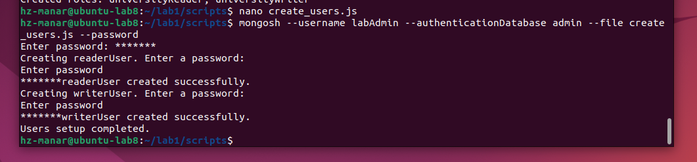

Passwords are entered through `passwordPrompt()` and are not stored in the script.

## 2.6 Granting and revoking a role

To test role assignment, I temporarily granted `universityWriter` to `readerUser`:

```bash
mongosh \
  --username labAdmin \
  --authenticationDatabase admin \
  --password \
  --file assign_role.js
```

The script calls:

```javascript
db.grantRolesToUser(
  "readerUser",
  [{ role: "universityWriter", db: "university" }]
);
```

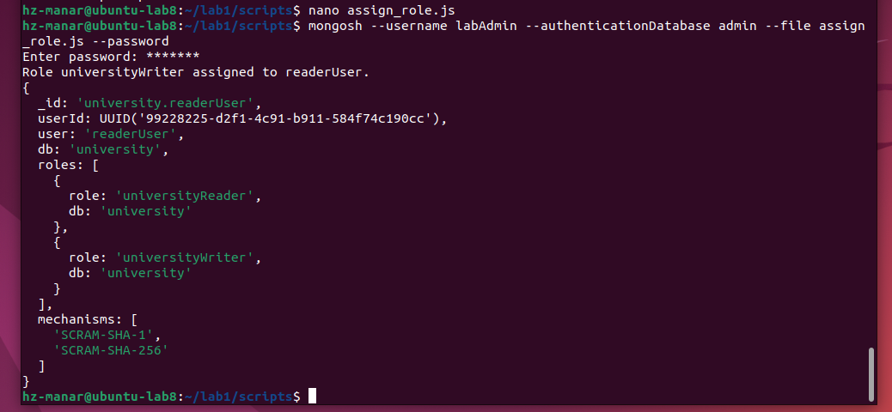

Then I revoked the same role with `revoke_role.js`:

```bash
mongosh \
  --username labAdmin \
  --authenticationDatabase admin \
  --password \
  --file revoke_role.js
```

```javascript
db.revokeRolesFromUser(
  "readerUser",
  [{ role: "universityWriter", db: "university" }]
);
```

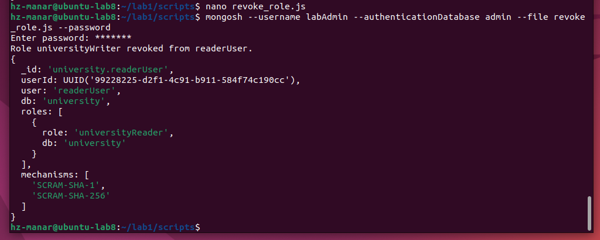

This covered both changing a user's privileges and rolling that change back.

## 2.7 Updating an existing role

I updated `universityReader` instead of deleting and recreating it. The resulting actions are:

```javascript
actions: ["find", "listCollections"]
```

The script uses `db.updateRole()`:

```bash
mongosh \
  --username labAdmin \
  --authenticationDatabase admin \
  --password \
  --file update_role.js
```

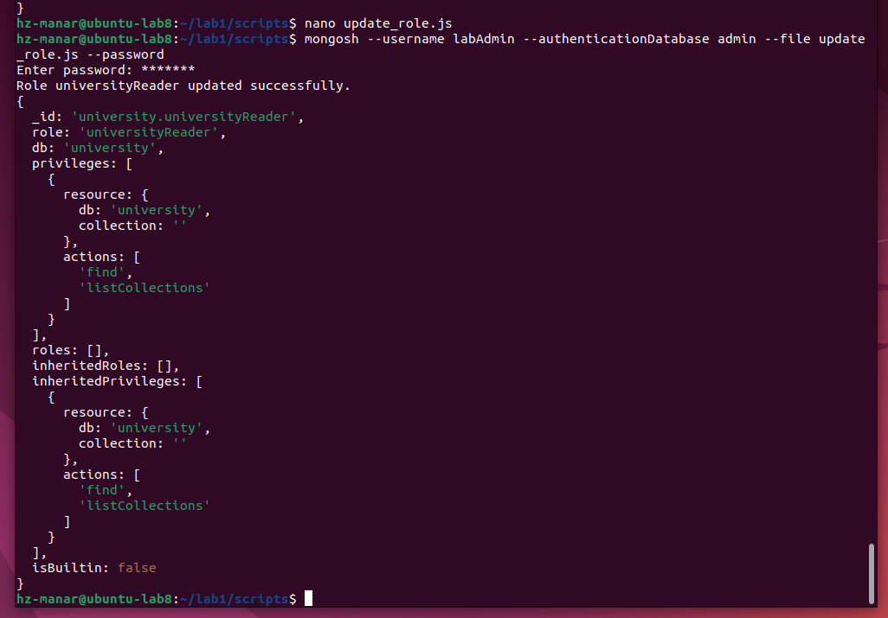

This confirmed that the permission set of an existing custom role can be changed in place.

## 2.8 Access to one collection only

For the collection-level requirement I created `studentsOnlyReader`:

```javascript
resource: { db: "university", collection: "students" },
actions: ["find"]
```

```bash
mongosh \
  --username labAdmin \
  --authenticationDatabase admin \
  --password \
  --file create_collection_role.js
```

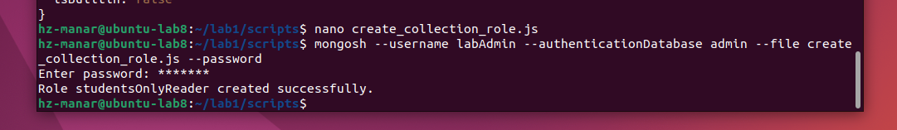

I then created `studentsUser` with only this role:

```bash
mongosh \
  --username labAdmin \
  --authenticationDatabase admin \
  --password \
  --file create_students_user.js
```

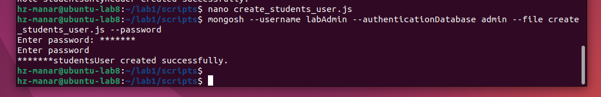

To verify the restriction, I logged in as `studentsUser` and queried two collections:

```bash
mongosh \
  --username studentsUser \
  --authenticationDatabase university \
  --password
```

```javascript
use university
db.students.findOne()
db.courses.findOne()
```

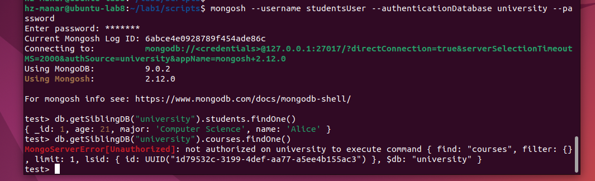

`students.findOne()` succeeded, while `courses.findOne()` returned `Unauthorized`. This was the important test for this requirement: the same user can read the allowed collection but not another collection in the same database.

## 2.9 Removing the temporary user and role

After the collection test I removed `studentsUser` and `studentsOnlyReader`:

```bash
mongosh \
  --username labAdmin \
  --authenticationDatabase admin \
  --password \
  --file delete_user_role.js
```

I checked the result directly:

```javascript
use university
db.getUser("studentsUser")
db.getRole("studentsOnlyReader")
```

Both returned `null`.

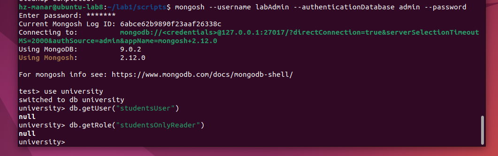

The cleanup script once printed an object-style result that was not very clear, so I used `getUser()` and `getRole()` instead of relying only on the script message.

---

# Part 3 — Backup and restore

## 3.1 Backup of one training database

`backup_database.sh` creates a dump of `university`:

```bash
./backup_database.sh
```

The output is stored in a timestamped directory, for example:

```text
~/mongodb-backups/university_2026-09-30_06-43-46/
```

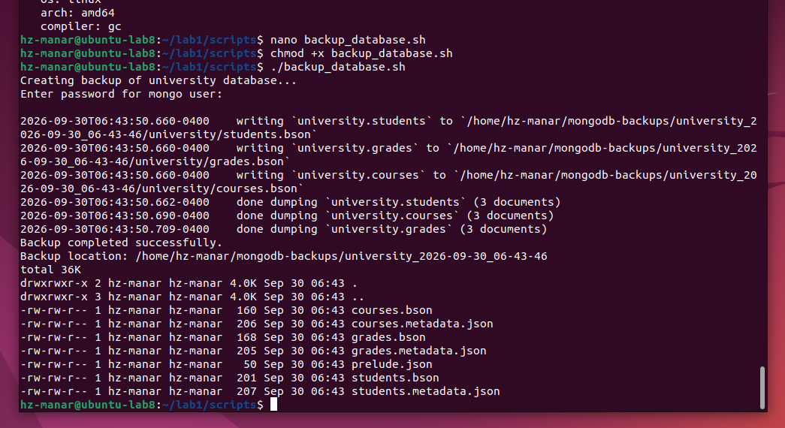

The timestamp is used so a later backup is stored separately instead of overwriting the previous one.

## 3.2 Second training database

To test backup of more than one training database, I created `research` with two collections:

```text
projects
results
```

```bash
mongosh \
  --username labAdmin \
  --authenticationDatabase admin \
  --password \
  --file create_second_database.js
```

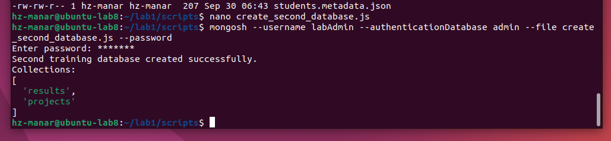

## 3.3 Backup of all training databases

`backup_all_databases.sh` backs up both training databases:

```bash
./backup_all_databases.sh
```

The lab databases are listed explicitly in the script:

```bash
DATABASES=("university" "research")
```

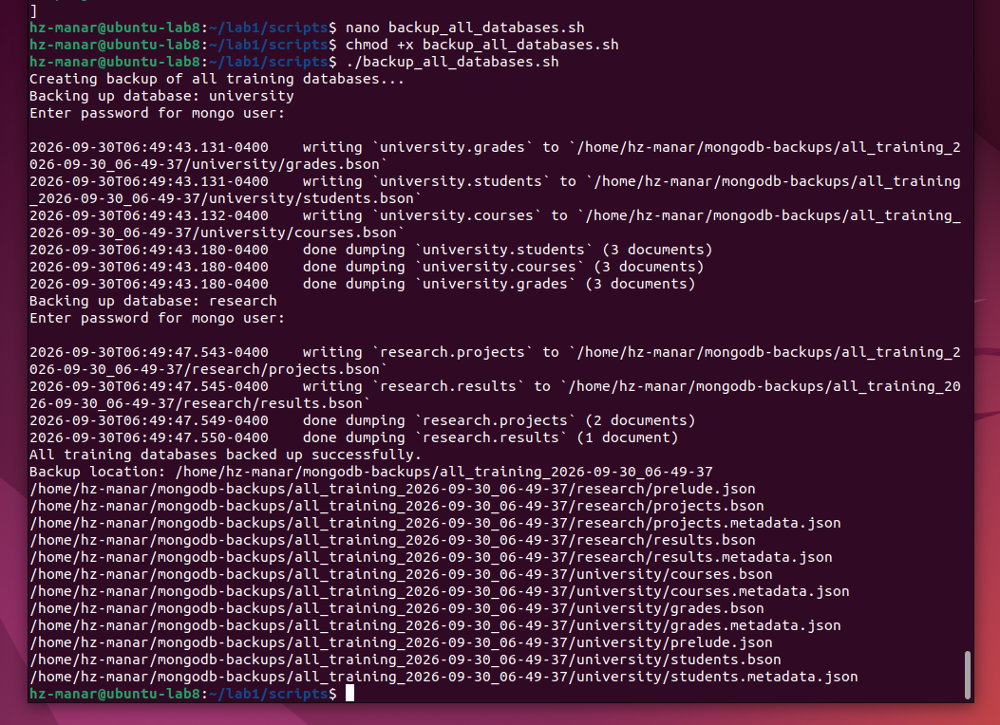

I kept the list explicit because these are the two databases created for this lab; unrelated system databases are outside the backup scope.

## 3.4 Keeping several backup copies

I ran the backup more than once and checked the destination:

```bash
ls -lah ~/mongodb-backups/
```

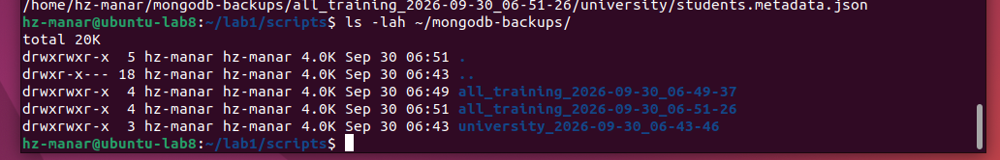

Several timestamped backup directories were present at the same time, so a new run did not replace the older copies.

## 3.5 Restore after deleting a collection

Before deletion I checked the collections in `university`:

```javascript
use university
show collections
```

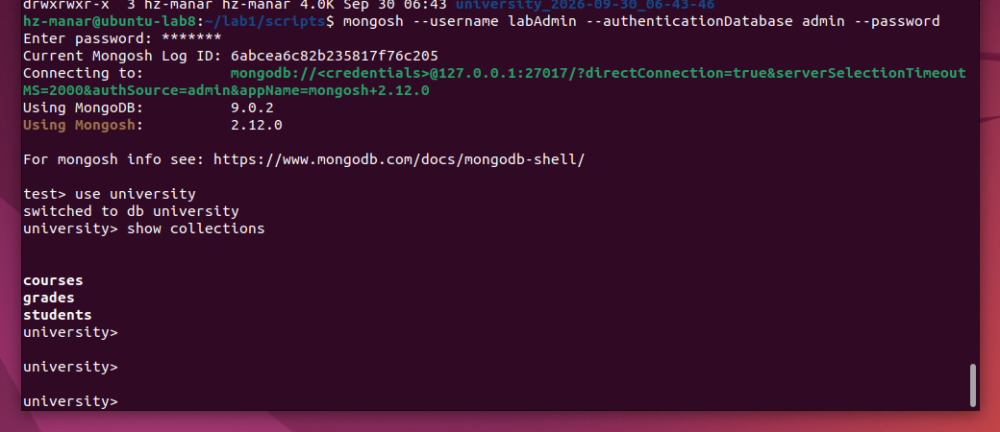

Then I dropped `students`:

```javascript
db.students.drop()
show collections
```

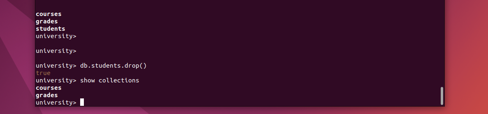

The collection disappeared while `courses` and `grades` remained.

For recovery I ran:

```bash
./restore_students.sh
```

The script restores only this namespace from the newest `all_training_*` backup:

```bash
--nsInclude="university.students"
```

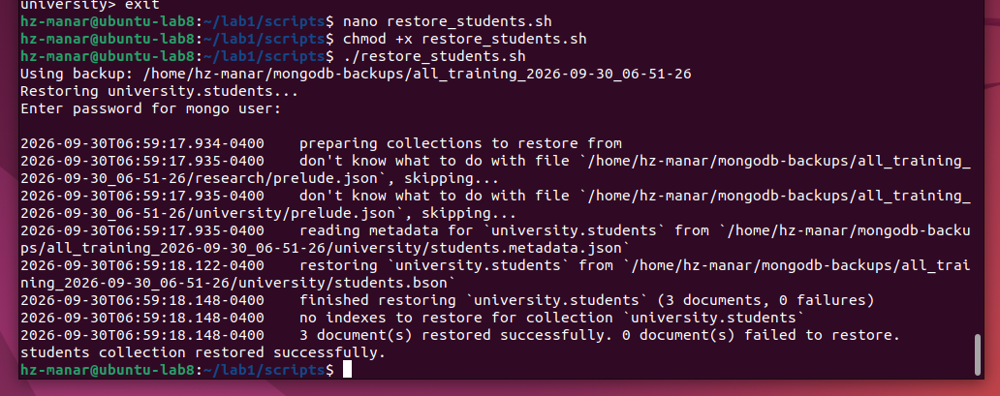

`mongorestore` reported three restored documents and zero failed documents. It also printed messages about unrelated metadata files while scanning the backup directory, but they did not affect the selected namespace.

Finally I checked the database again:

```javascript
use university
show collections
db.students.countDocuments()
```

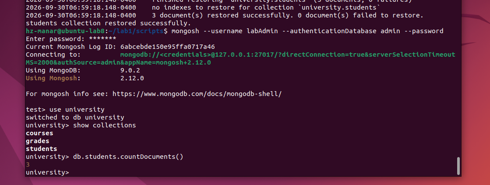

`students` was back and contained `3` documents. This was the actual restore check; the existence of dump files alone would not have been enough.

---

# Part 4 — Monitoring

## 4.1 Monitoring user

I created a separate MongoDB account for the exporter instead of using `labAdmin`:

```bash
mongosh \
  --username labAdmin \
  --authenticationDatabase admin \
  --password \
  --file create_monitor_user.js
```

Roles:

```javascript
{ role: "clusterMonitor", db: "admin" }
{ role: "read", db: "local" }
```

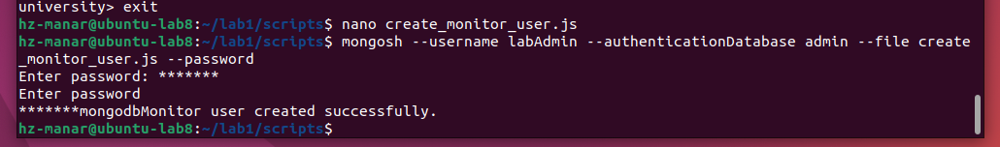

This keeps the monitoring account less privileged than the administration account.

## 4.2 Percona MongoDB Exporter

I installed Percona MongoDB Exporter with:

```bash
./install_mongodb_exporter.sh
```

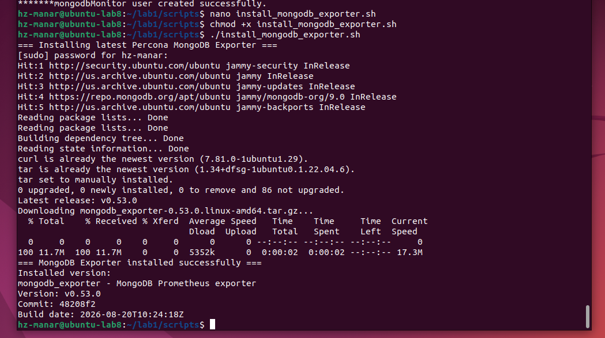

The installed version was `0.53.0`.

The exporter runs as a systemd service configured by:

```bash
./setup_mongodb_exporter_service.sh
```

Its password is stored locally on the VM in:

```text
/etc/mongodb_exporter/mongodb_monitor_password
```

The file is owned by `root:mongodb_exporter` with mode `0640`. It is not part of the repository.

The final service unit is in `configs/mongodb_exporter.service`.

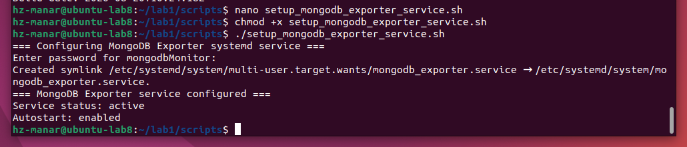

I checked the endpoint directly:

```bash
curl -s http://127.0.0.1:9216/metrics | grep '^mongodb_' | head -n 20
```

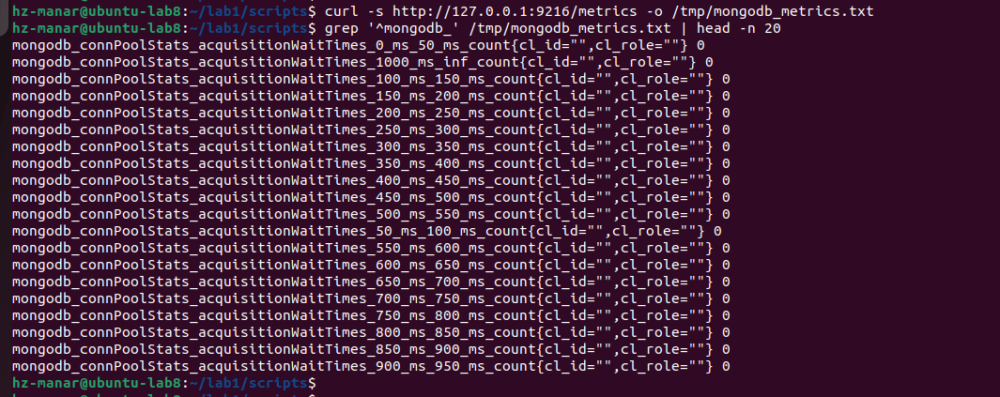

The exporter returned MongoDB metrics for connections, WiredTiger cache, network traffic, and operation counters. I used the metric names exposed by this installed version when I built the Grafana queries.

## 4.3 Prometheus

Prometheus is installed by:

```bash
./install_prometheus.sh
```

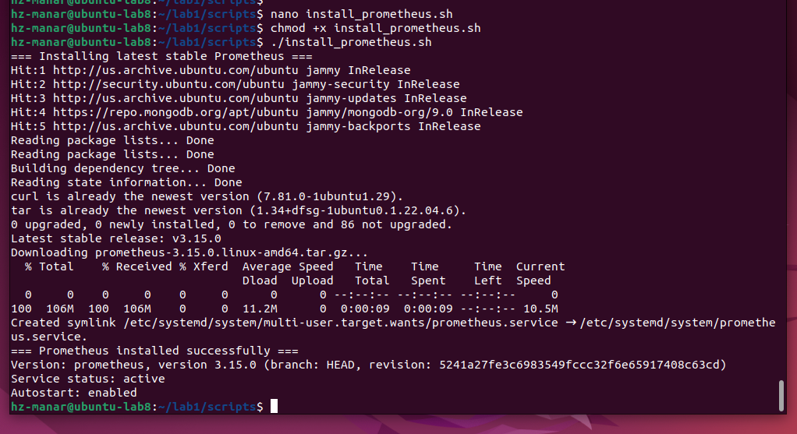

The installed version was `3.15.0`.

The final scrape config is `configs/prometheus.yml`:

```yaml
global:
  scrape_interval: 5s

scrape_configs:
  - job_name: "prometheus"
    static_configs:
      - targets:
          - "127.0.0.1:9090"

  - job_name: "mongodb"
    static_configs:
      - targets:
          - "127.0.0.1:9216"
```

I used a five-second scrape interval so changes during the load test would be visible quickly.

To check the exporter target from Prometheus:

```bash
curl -sG 'http://127.0.0.1:9090/api/v1/query' \
  --data-urlencode 'query=up{job="mongodb"}'
```

The result contained:

```text
instance="127.0.0.1:9216"
job="mongodb"
value = 1
```

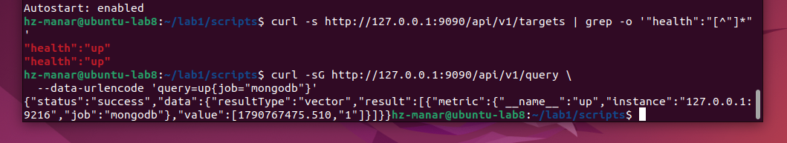

`up = 1` confirmed that Prometheus was successfully scraping the exporter.

## 4.4 Grafana

Grafana OSS is installed by:

```bash
./install_grafana.sh
```

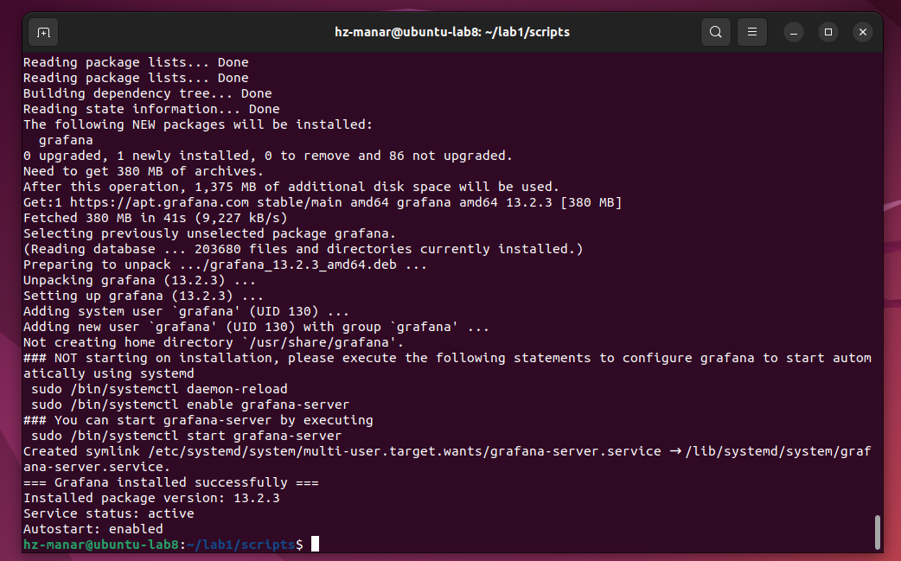

The installed version was `13.2.3`.

I added Prometheus as a Grafana data source with:

```text
http://127.0.0.1:9090
```

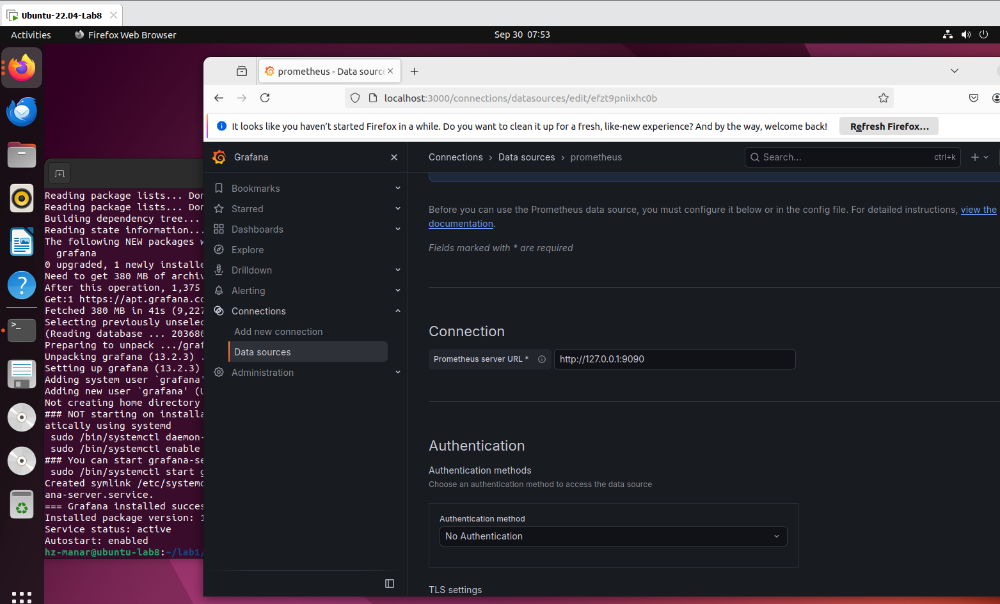

**Save & test** returned:

```text
Successfully queried the Prometheus API.
```

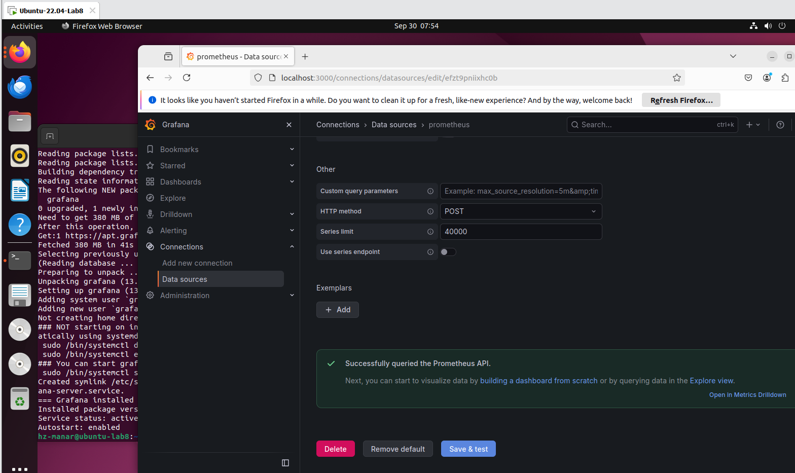

At this stage the monitoring path was:

```text
MongoDB -> Percona MongoDB Exporter -> Prometheus -> Grafana
```

## 4.5 Dashboard and selected metrics

I created the dashboard `MongoDB Monitoring - Lab 1` with four panels.

### Operations per second

```promql
sum by (legacy_op_type) (
  rate(mongodb_ss_opcounters{legacy_op_type!="command"}[1m])
)
```

This is the rate of MongoDB CRUD operation counters. I excluded the generic `command` series so the application activity is easier to read.

### Current connections

```promql
mongodb_ss_connections{conn_type="current"}
```

This shows the current number of MongoDB connections.

### WiredTiger cache

```promql
mongodb_ss_wt_cache_bytes_currently_in_the_cache / 1024 / 1024
```

The value is converted to MB for the graph.

### Network traffic

Input:

```promql
rate(mongodb_ss_network_bytesIn[1m]) / 1024
```

Output:

```promql
rate(mongodb_ss_network_bytesOut[1m]) / 1024
```

These show network traffic in KB/s.

Before generating load I captured the idle dashboard:

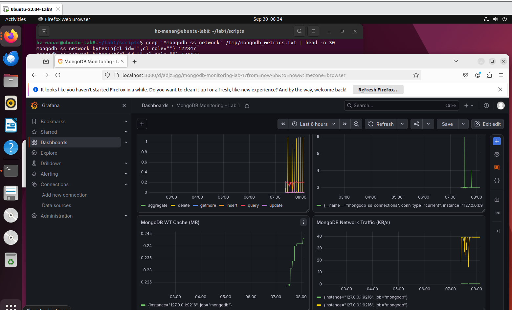

This gave me a baseline for comparison.

The working dashboard was exported to:

```text
configs/grafana-dashboard.json
```

The command I ended up using was:

```bash
curl -s -u admin \
  'http://127.0.0.1:3000/apis/dashboard.grafana.app/v1/namespaces/default/dashboards' \
| python3 -c 'import sys,json; d=json.load(sys.stdin); x=next(i for i in d["items"] if i["spec"].get("title")=="MongoDB Monitoring - Lab 1"); print(json.dumps(x["spec"], indent=2))' \
> ~/lab1/configs/grafana-dashboard.json
```

The password is entered by `curl` and is not written into the JSON file.

This step took some trial and error. Several older Grafana API examples I found did not match the API exposed by version 13.2.3. The endpoint above returned dashboard objects under `items`, so I selected the one with the exact title and saved its `spec`.

## 4.6 Load test

The load generator is `scripts/generate_load.js`. It uses a separate collection:

```text
university.load_test
```

Each cycle performs an insert, a read, and an update:

```javascript
loadCollection.insertOne(...);
loadCollection.findOne(...);
loadCollection.updateOne(...);
```

I ran it with:

```bash
mongosh \
  --username labAdmin \
  --authenticationDatabase admin \
  --password \
  --file generate_load.js
```

The final version runs `180` batches with `300` insert/read/update cycles per batch and a one-second sleep after each batch. The script prints “180 seconds”, but the database work inside each batch also takes time, so I use that value as the batch count rather than an exact wall-clock benchmark.

My first version finished too quickly to capture comfortably in Grafana. I increased the number of batches and operations so the change stayed visible long enough to compare it with the baseline.

During the run, the graphs changed clearly:

- operations rose to roughly 175+ ops/s in the captured interval;
- current connections increased from around 3 to around 8;
- WiredTiger cache usage increased;
- network traffic rose to roughly 90–100+ KB/s.

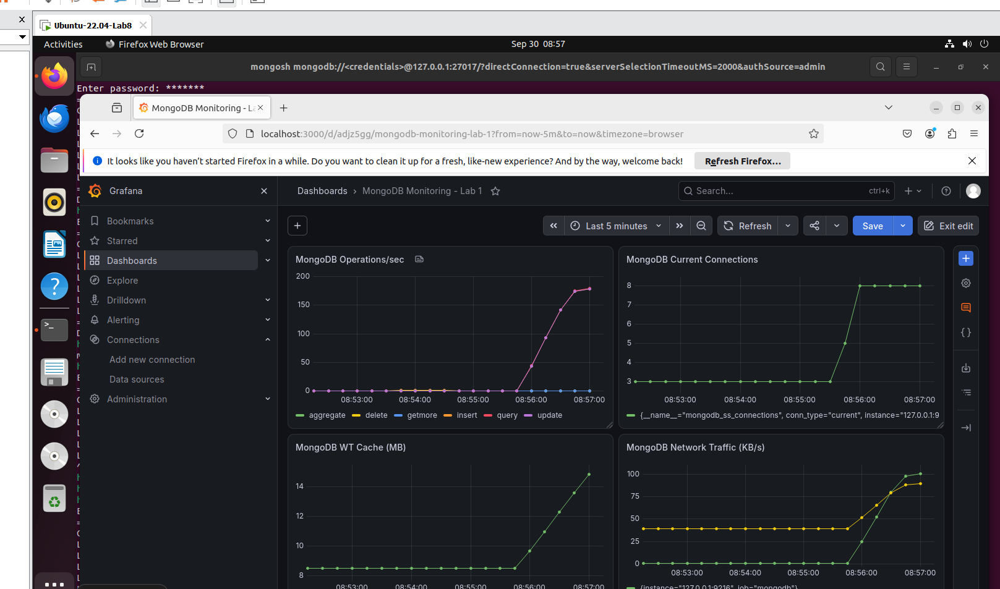

After the workload stopped, the activity dropped back toward the idle level.

The script finished with:

```text
=== Load test completed ===
Documents in load_test: 125293
```

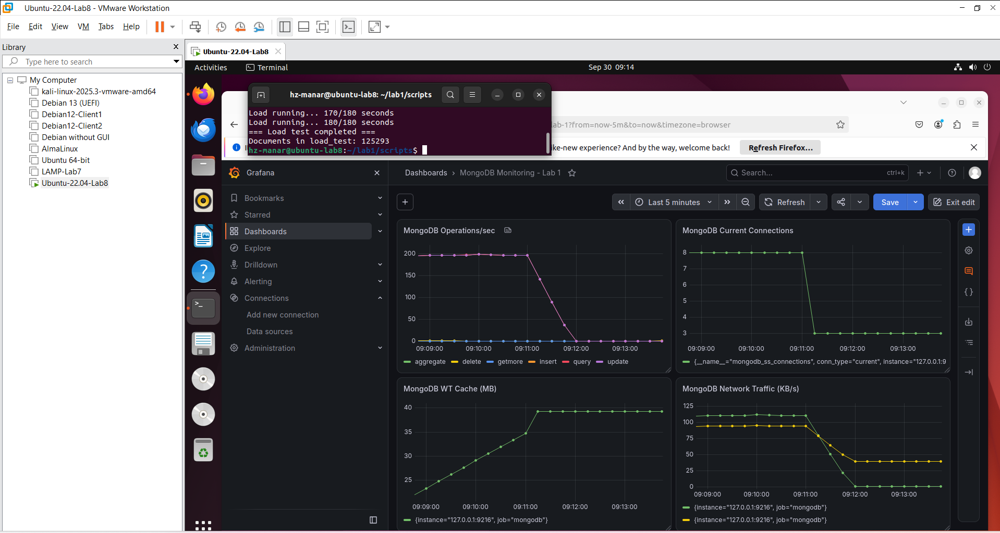

The `125293` count is cumulative. I ran the generator several times while tuning it and did not clear `load_test` after every attempt.

---

# Problems I ran into

A few parts needed more than one attempt.

### Authentication order

I created `labAdmin` before enabling authorization. After enabling it, I tested both an unauthenticated request and an authenticated request. Doing both tests caught configuration mistakes more reliably than checking the config file alone.

### Cleanup verification

The output from one run of the user/role cleanup script was not very readable. I checked the final state with `db.getUser()` and `db.getRole()`, which was clearer and confirmed that both objects were gone.

### Selective restore output

`mongorestore` printed messages about other metadata files while scanning the backup directory. I checked the restore result instead of treating every message as a failure: `university.students` restored three documents with zero failed documents, and `countDocuments()` confirmed the data.

### Exporter metric names

I checked `/metrics` before writing the PromQL queries. That avoided assuming metric names from a different exporter version.

### Grafana export API

The dashboard export took the most trial and error. The API examples I first tried were for older Grafana versions. With 13.2.3, I queried the current dashboard API, selected the dashboard by title, and saved the `spec`.

### Load-test duration

The first workload was too short for a useful screenshot, so I increased it to 180 batches and 300 cycles per batch. This is also why the final document count is cumulative rather than the count from one run.

---

# Security and repository notes

No real password is committed in `lab1/`.

MongoDB user passwords are entered with `passwordPrompt()` or an interactive password prompt. The exporter password exists only on the VM at:

```text
/etc/mongodb_exporter/mongodb_monitor_password
```

The setup script applies:

```text
owner: root:mongodb_exporter
mode: 0640
```

The course work is kept in one repository with a separate `lab1/` directory. For submission I use a short-lived branch and merge the lab changes into `main` instead of using `main` as a scratch branch.

---

# Final files

Automation scripts:

```text
scripts/install_mongodb.sh
scripts/mongodb_service.sh
scripts/check_mongodb.sh
scripts/create_test_data.js
scripts/create_admin.js
scripts/create_roles.js
scripts/create_users.js
scripts/assign_role.js
scripts/revoke_role.js
scripts/update_role.js
scripts/create_collection_role.js
scripts/create_students_user.js
scripts/delete_user_role.js
scripts/create_second_database.js
scripts/backup_database.sh
scripts/backup_all_databases.sh
scripts/restore_students.sh
scripts/create_monitor_user.js
scripts/install_mongodb_exporter.sh
scripts/setup_mongodb_exporter_service.sh
scripts/install_prometheus.sh
scripts/install_grafana.sh
scripts/generate_load.js
```

Configuration files:

```text
configs/mongod.conf
configs/prometheus.yml
configs/mongodb_exporter.service
configs/prometheus.service
configs/grafana-dashboard.json
```

---

# Conclusion

The lab covered the complete operational path: deploy MongoDB, control the service, enable authentication, manage users and custom roles, create and restore backups, and observe the database under load.

The two checks I found most useful were the collection-level permission test and the restore test. In the first case the same user could read `students` but received `Unauthorized` for `courses`. In the second case I dropped `students`, restored only that namespace from backup, and verified that the three documents returned.

The monitoring part also worked end to end. MongoDB metrics reached Prometheus through the Percona exporter, Grafana displayed them, and the load generator produced visible changes in operations, connections, cache usage, and network traffic.

If I reused the same setup outside a lab, the next things I would add are scheduled backups, automatic restore checks, and a dedicated secrets-management solution instead of a local password file.
